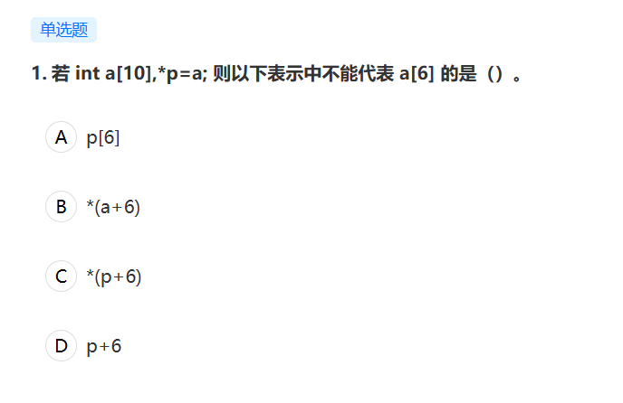

---
tags:
  - c
  - 八股
  - c语言
  - 秋招
---

# 240918-C 语言八股


> [参考 1](https://blog.csdn.net/qq_43706223/article/details/133301198)
> [参考 2](https://blog.csdn.net/weixin_50591371/article/details/141286333?spm=1001.2101.3001.6650.2&utm_medium=distribute.pc_relevant.none-task-blog-2%7Edefault%7EYuanLiJiHua%7EPosition-2-141286333-blog-133301198.235%5Ev43%5Econtrol&depth_1-utm_source=distribute.pc_relevant.none-task-blog-2%7Edefault%7EYuanLiJiHua%7EPosition-2-141286333-blog-133301198.235%5Ev43%5Econtrol&utm_relevant_index=5)
## 1 volatile

防止编译器对变量进行优化，让编译器每次存取该变量的时候都要去内存里存取，而不是寄存器的备份。

编译器优化有可能会修改变量：

```c
int a, b;
a = 1; // 1
b = a; // 2
```

1. 首先 1 写入 CPU，然后再从 CPU 中将 1 读出，再写入 a 所在的内存中（&a）
2. 先从内存中将 a 的值取出到 CPU，再从 CPU 中将值写入 b 的内存地址中

考虑下面一段代码，展现了编译器优化的过程：

```c
int a = 1, b, c;
b = a; // 1
c = a; // 2
```

1. &a -> CPU -> &b
2. &a -> CPU -> &c

编译器在优化这段代码的时候会省略掉标号 2 中的 `&a -> CPU` 的过程，因为标号 1 中已经将 a 的值放在寄存器（CPU）中过了。

不过如果在 `b=a` 之后 `a` 在内存中发生了变化，例如正好一个中断改变了 `a` 的值，就会导致中断回来之后的标号 2 代码还是将原来 `a` 的值给了 `c`

引入 `volatile` 之后，执行标号 2 代码的时候便会不忽略 `&a -> CPU` 这个步骤

因此，一般在以下情况使用 volatile：

1. 并行设备的硬件寄存器，当声明指向设备寄存器的指针的时候需要用，因为每次对其的读写都可能有不同意义
2. 中断服务程序中修改的“有被其他程序引用的变量”
3. 多线程应用中被好几个任务共享的变量

### 1.1 一个参数可以即是 const 又是 volatile 吗

可以，可以用于表示只读的状态寄存器

### 1.2 指针可以是 volatile 吗

可以，例如中断服务子程序中需要修改一个指向 buffer 的指针时

### 1.3 辨别代码

```c
int square(volatile int* ptr)
{
	return *ptr * *ptr
}
```

函数目的为返回 ptr 指向的值的平方，但由于 ptr 被定义为 volatile 型了，所以编译器将会等效为：

```c
int square(volatile int* ptr)
{
	int a, b;
	
	a = *ptr;
	b = *ptr;
	
	return a * b;
}
```

因为 `*ptr` 被设置为 `volatile` ，因此在对 a 以及 b 赋值的过程中，有可能 ptr 发生了改变，这是这条函数下不愿发生的，正确的应该修改为：

```c
long square(volatile int* ptr)
{
	int a;
	
	a = *ptr;
	return a * a;
}
```


## 2 static

声明为静态类型的变量，存储在静态区

- 如果是静态局部变量，作用域即为一对花括号内
- 如果是静态全局变量，作用域即为当前文件

`static` 修饰的全局变量以及函数只能在本文件中被调用

- **函数体内：** 生命周期和函数体相同
- **模块内（函数体外）：** 一个被声明为静态的变量可以被模块内所用函数访问，不能被模块外其他函数访问，是一个本地的全局变量

## 3 const

定义变量为常量

当修饰为指针的时候：

```c
const int *p1;
int const *p2;
int* const p3;
const int* const p4;
```

- 第一种和第二种为常量指针，语义完全相同
- 第三种为指针常量
- 第四种是指向常量的常指针

编译器一般不为普通的 const 常量分配存储空间，而是将其保存在符号表中，使得其成为一个编译期间的常量，考虑这样一段代码：

```c
const int maxUsers = 100;
```

编译器再编译这段代码的时候，可以决定不为其分配内存空间，而是在需要使用 `maxUsers` 的时候直接使用值 `100`

### 3.1 什么是常量指针：

- 不能通过这个指针来改变变量的值，有其他的方法可以改变变量的值
- 可以修改这个指针指向的地址

> `*p1 = 5;` 不被允许；`p1 = &someOtherInt` 是允许的

### 3.2 什么是指针常量：

- 也就是指针本身是个常量，该指针指向的地址不能被修改，但是指向的地址中保存的数值可以改变

> `*p3 = 5;` 是允许的，但 `p3 = &someOtherInt;` 不被允许

### 3.3 什么是指向常量的常指针：

- 上述两者的结合，也就是指针本身不能修改，指向的变量的值也不能修改
- 不过需要注意还是可以通过别的普通指针修改变量的值

> `*p4 = 5;` 和 `p4 = &someOtherInt;` 都是不允许的。

### 3.4 如果 const 修饰的是函数的参数：

- 表示在函数体内不能修改这个参数的值

### 3.5 如果 const 修饰的是函数的返回值：

- 修饰的是指针：指针指向的地址不能被修改，并且返回值只能被赋给用 const 修饰的指针
- 修饰的是变量：没有意义，因为返回值为临时变量，函数调用之后这个临时变量的生命周期也就结束了，将返回值修饰为 const 是没有意义的

> 针对修饰对象为指针的情况有以下例子:
> `const char getString();` 定义一个返回 char 的函数
> `char *str = getString();` 错误，str 没有被 const 修饰
> `const char *str = getString();` 正确

## 4 typedef 和 define 的异同

首先都是取别名，增强程序的可读性，但是在原理、功能、作用域、对指针的操作这四个方面上都有所不同：

### 4.1 原理上

`#define` 是预处理指令，在预处理时简单且机械地进行字符串替换，不检查正确性，不管含义是否正确，在编译已被展开的源程序的时候才会发现可能的错误并报错。

`typedef` 是关键字，编译的时候被处理，具有类型检查的功能，在自己的定义域内给已经存在的类型起一个别名，但不能在一个函数定义内使用标识符。

### 4.2 功能上

`typedef` 用来定义类型的别名，一般常用的如为自己定义的类型（`struct` 定义的）起别名，可以起到利于记忆与辨识的功能，如：

```c
struct wiegand_reader
{
    gpio_num_t gpio_d0, gpio_d1;
    wiegand_callback_t callback;
    wiegand_order_t bit_order;
    wiegand_order_t byte_order;

    uint8_t *buf;
    size_t size;
    size_t bits;
    esp_timer_handle_t timer;
    bool start_parity;
    bool enabled;
};
```

这样一个结构体，将一个 wiegand 读卡器抽象为一个类别，对于这样的结构体可以在定义的时候直接：

```c
typedef struct wiegand_reader
{
	xxx;
	xxx;
	xxx;
} wiegand_reader_t;
```

加上后缀 `_t` 是常用的写法，意为 `type` ，向编程人员指示这是一个变量类型

### 4.3 作用域上

`#define` 没有作用域，预定义过后的宏在所有的程序中都可以使用，`typedef` 则有自己的作用域。

### 4.4 对指针的操作上

考虑这样一个对比场景：

```c
#define INTPTR1 int*
typedef int* INTPTR2;
INTPTR1 P1, P2;s
INTPTR2 P3, P4;
```

- INTPTR1 的情况为进行字符串替换：`int* p1; int p2;` 表达的意义为声明一个 int 型指针变量 p1 和一个整形变量 p2
- INTPTR2 的情况是“具有含义的替换”：`int* p1; int* p2;` 也就是两个都是指针变量

## 5 变量

### 5.1 定义常量 `#define` 和 `const` 的区别，谁更好：

- `#define` 可以替代常数、表达式、甚至代码段，但容易出错，有的时候可以作为很强大的工具使用，例如 uthash 库这个仅头文件实现的哈希表库就充分利用了 `#define` 的优势
- `const` 的引入也可以增强可读性，使程序的维护和调试变得更加方便

使用时的差异一般在如下方面：

- `#define` 声明周期止于编译期，不分配内存，存在于程序的代码段，而 `const` 存在于程序的数据段，在堆栈中确实有分配了空间，可以被调用、传递
- 编译器可以对 `const` 进行类型检查，`#define` 则不会
- 有些 IDE 支持调试 `const` 定义的常量，又由于会对 `const` 进行安全检查，因此更加倾向用 const 来定义常量类型

### 5.2 全局变量和局部变量的区别：

- 作用域不同，全局为程序块，局部为当前函数，引申一下则为使用方式的不同，全局的程序的各个部分都可以用到，局部的只能在局部使用
- 生命周期不同，全局与主程序共周期，局部与局部函数、局部循环体等部分共周期
- 内存中的存储方式不同，全局变量（静态全局、静态局部变量）分配在全局数据区（静态存储空间），局部分配在栈区

### 5.3 全局变量可不可以定义在被多个. C 文件包含的头文件中？

- 可以，在不同的 C 文件中以 static 形式来声明同名全局变量
- 可以在不同的 C 文件中声明同名的全局变量，前提是只有一个文件中赋初值

### 5.4 局部变量能否和全局变量重名

- 可以，局部会屏蔽全局
- 函数内部引用的时候会使用局部而不会使用全局，并且在某些编译器中同一个函数内可以定义多个同名的局部变量，在循环体内使用各自的同名局部变量就好，作用域被限制在各自的循环体内

## 6 数组

### 6.1 数组指针

指向数组的指针，考虑一个场景：

```c
int b[12] = {1, 2, 3, 4, 5, 6, 7, 8, 9, 10, 11, 12};
int (*p)[4];
p = b;
printf("%d\n", **(++p));
```

`p` 则为数组指针，上述代码的重点在于如何理解 `p = b` 以及 `**(++p)` ：

- 首先 `p` 是一个指向“包含 4 个 int 成员的数组”的指针，在将 `b` 赋值给 `p` 的时候，相当于 `p` 的每个元素都会存储 `b` 数组每四个元素的起始地址。在 `p = b;` 这行代码执行后，`p` 将指向 `b`，也就是将 `b` 的地址值赋给 `p`
- 于是 `++p` 之后 `p` 指针将向后移动 4 个 int ，解第一层引用得到 `b[4]` ，解第二层引用得到其值 `5`

### 6.2 指针数组

指针数组表示的是一个数组，其中的元素为指针，考虑下列示例：

```c
int i;
int* p[4];
int a[4] = {1, 2, 3, 4};
p[0] = &a[0];
p[1] = &a[1];
p[2] = &a[2];
p[3] = &a[3];
for (i = 0; i < 4; i++) printf("%d", *p[i]);
```

输出 1234

### 6.3 数组下标

可以为负数，下标指示给出一个与当前地址的偏移量而已，根据偏移量能够定位到目标地址即可

## 7 指针

### 7.1 函数指针

函数指针，首先是一个指针。

定义一个函数后，编译时系统则会为这个函数代码分配一段内存，这段空间的首地址则为这个函数的地址，函数名也就表示的是这个地址。

>类似数组名的概念

既然是一个地址，那就可以定义一个指针变量来存放。该指针变量就被叫做函数指针：

```c
int(*p) (int,int);
```

- `int` 开头的 int 表示该函数返回 int 类型
- `(*p)` `*` 先与 p 结合，表示 p 是一个指针

**注意：** 括号在此处不能省略，括号能够改变优先级，如果省略了的话，就被视作声明了一个“返回指针的函数”：

```c
int* p(int,int);
```

- `int*` `*` 先与 int 结合，表示 int 指针，作为 p 函数的返回值

**注意：** 函数指针没有++和--运算

### 7.2 特别注意：区分 `int *p` 和 `int (*p)`


这俩是不同的变量类型，前者是一个指向 int 类型的指针，后者有可能是一个数组指针或是返回 int 类型的函数指针：

```c
// int *p
int value = 10;
int *p = &value; // p 指向 value
*p = 20; // 通过指针修改 value 的值，现在 value = 20
```

```c
// int (*p)
int arr[5] = {1, 2, 3, 4, 5};
int (*p)[5] = &arr; // p 指向一个包含5个整数的数组
(*p)[0] = 10; // 修改数组的第一个元素，现在 arr[0] = 10

int add(int a, int b) return a + b;
int (*p)(int, int) = add; // p 指向函数 add
int result = p(3, 5); // 调用 add 函数，结果为 8
```


### 7.3 指针函数

返回值为地址，必须使用同类型的指针变量来接受

后缀中的括号表示这是一个函数：

```c
int *pfun(int, int);
```

`*` 的运算符优先级低于 `()`，因此括号先与 `pfun` 进行结合

### 7.4 数组和指针的异同

#### 7.4.1 存储方式

数组一般存储在静态存储区或栈上，而指针可以随时指向任意类型的内存块

- 数组是连续存放的，一块连续的内存空间
- 数组是根据数组的下标来进行访问的
- 指针可以指向任意类型的数据
- 指针的类型说明了它所指向地址空间的内存

#### 7.4.2 sizeof

- 数组
	- 数组占用的内存空间：sizeof（数组名）
	- 数组的大小：sizeof（数组名）/sizeof（数据类型）
- 指针
	- 在 32 位平台下，无论类型，sizeof（指针名）都是 4（4x8=32）
	- 在 64 位平台下，无论类型，sizeof（指针名）都是 8（8x8=64）

#### 7.4.3 数据访问

- 指针的访问方式是间接访问，需要用到解引用
- 数组的访问方式是直接访问，可通过下标访问或数组名+元素偏移量的方式

#### 7.4.4 使用场景

- 指针一般用于动态的数据结构、动态内存的开辟
- 数组一般用于固定个数且类型统一的数据结构以及隐式分配

### 7.5 野指针？

- 野指针是指向不可用内存的指针，当指针被创建的时候指针不可能自动指向 NULL，这个时候默认值是随机的，这个时候的指针成为野指针
- 当指针被 free 或 delete 释放之后，如果指针没有被手动设置为 NULL，则会产生野指针，free 和 delete 只是释放了指针指向的内存，没有把指针本身释放掉
- 指针操作超越了变量的作用范围也会导致野指针的产生

避免方法：

- 初始化为 NULL
- 用 malloc 分配内存
- 用已有合法的可访问的内存地址对指针初始化
- 指针用完后释放内存，将指针赋 NULL

关于 malloc 函数的分配完内存后的注意点：

- 检查分配是否成功，malloc 若成功会返回内存的首地址，不成功会返回 NULL
- 清空内存中的数据

## 8 内存

### 8.1 C 语言中的内存分配方式

#### 8.1.1 静态存储区

这一部分的内存分配在程序编译之前完成，整个程序的运行期间都存在，全局变量、静态变量就存储在此处

#### 8.1.2 栈上分配

- 不需要手动干预，栈内存里存放的东西生命周期为自动管理
- 在函数执行时，内部的局部变量的存储单元在栈上创建，函数执行结束之后存储单元自动释放
- 栈空间通常较小，主要用于存储函数的局部变量、函数参数、返回地址等
- 栈是多线程编程的基础，每个线程都最少由一个自己专属的栈，用来存储本线程运行时的各个函数临时变量，以及维系函数调用和函数返回时的关系以及函数运行场景

#### 8.1.3 堆上分配

- 需要手动管理，通过特定的函数来分配与释放，堆数据的生命周期由程序员控制
- 一般适用于存储动态的数据结构，如动态数组、链表等，或在程序运行期间需要动态分配和释放的内存
- 堆的大小通常较大，受限于单片机的总内存大小，适合存储动态分配的数据结构

栈适合快速、临时的内存分配；而堆适合复杂、长期的内存管理

#### 8.1.4 堆栈相关寄存器

`ss（Stack Segment）` 堆栈寄存器，用于存放当前堆栈段的选择子（一个 16 位的值），用于访问描述堆栈段的段描述符。
堆栈段描述符包含了堆栈的基地址和限长等信息。

但在 arm 架构下并不存在堆栈寄存器，arm 架构下的堆栈一般直接使用 SP（寄存器 R13）来进行管理。

#### 8.1.5 内存泄漏

**什么是内存泄漏？**

申请了一块内存空间，使用完毕之后没有释放掉。表现在宏观上为程序运行时间越长占用的内存越多：程序申请了一块内存，但在一段时间之后没有任何一个指针指向它，那么这块内存就泄漏了。

**如何判断？**

- 良好的编码习惯，使用了内存分配的函数后，使用完毕记得使用相应函数释放掉。
- 将分配的内存指针用链表的形式自行管理，使用完毕后从链表中删除，这样在程序结束之后可以统一检查链表。

#### 8.1.6 `malloc` 和 free

malloc 向系统申请分配所指定 size 个字节的内存空间，返回类型为 `void *` 类型，也就是未指定类型的指针，而 C/C++中规定，`void *` 类型可以强转为任何其他类型的指针。

## 9 预处理

### 9.1 ` #error `

编译程序的时候遇到 ` #error ` 则会生成一个编译错误的提示消息，并停止编译

```c
#error [自己定义的 error-message]
```

**使用场景：**

程序较大的时候，很多宏定义是在外部指定的，比如 `makefile` 中或是其他系统头文件中指定的，不太确定一个宏是否有被定义的时候就可以使用 ` #error `

### 9.2 使用 ` #define ` 声明常数，避免数据溢出问题

例如一年含多少秒：

```c
#define SEC_PER_YEAR (60*60*24*365) UL
```

### 9.3 ` #include <filename.h>` 和 ` #include "filename. h"` 的区别

- 带 `<>` 的编译器将会先从标准库路径开始搜索，系统文件调用较快
- 带 `""` 的编译器将会从用户工作路径开始搜索，自定义文件调用较快

### 9.4 头文件的作用

1. 通过头文件来调用库功能，在需要保密源代码的时候，即可向用户提供头文件和二进制库即可，用户只需要按照头文件的接口声明来调用库功能即可，编译器会从二进制库中提取对应的实现
2. 头文件能够加强类型安全检查。当某个接口被实现或被使用的时候，其方式若与头文件中的声明不一致，编译器就会指出错误，减轻程序员调试、改错的工作量

### 9.5 头文件中定义静态变量可行吗

不可行，一是会造成资源浪费，二是也可能引起程序错误。

如果在头文件中定义了静态变量的话，按照编译的顺序，在每个使用了该头文件的 `. c` 文件都会单独存在一个静态变量，会引起空间浪费以及程序错误

因此不推荐在头文件中定义任何变量，也包括静态变量

### 9.6 写标准宏 MIN，返回传入的两个参数中较小的那一个

```c
#define MIN（A, B） ((A) <= (B) ? (A) : (B))
```

### 9.7 宏中的 `#` 以及 `##` 的用法

**`#` 字符串化操作符**

可以将一个宏参数直接转换成对应的字符串

```c
#define CONVERT (a) #a
int test = 10;
printf (CONVERT (test));
/* ↓和这句一样↓ */
printf ("test");
```

最后输出的是宏参数的参数名

**`##` 符号连接操作符**

可以将宏定义的多个形参转换成一个实际参数名。

```c
#define CAT (a, b) a##b
int num5 = 20;
printf ("%d\n", CAT (num, 5));
/* ↓和这句一样↓ */
printf ("%d\n", num5);
```

## 10 ISR 所涉及的考点

考虑一段中断服务函数，指出错误：

```c
__interrupt double compute_area(double radius)
{
    double area PI * radius * radius;
    printf("Area = %f\n", area);
    return area;
}
```

1. ISR 不能有返回值，也不能传递参数
2. ISR 应当快进快出，不推荐进行浮点运算
3. `printf()` 是不可重入函数，不能在 ISR 中使用

>不可重入函数：

>指的是在执行过程中会改变全局变量或静态变量状态的函数，使得函数的再次调用可能会导致不可预测的结果，该类函数通常依赖于内部状态或共享资源，如文件指针、内存缓冲区、环境变量等

>不可重入函数的主要问题是它们不是线程安全的，也就是说，它们不能保证在多线程环境中被多个线程同时调用时的正确性。在多任务或多线程操作系统中，这可能会导致数据竞争、资源冲突或其他同步问题。

ISR 通常需要满足以下要求：

1. **快速执行**：ISR 应该尽可能快地执行完毕，以减少对系统其他部分的干扰。
2. **最小化资源使用**：ISR 应该避免使用可能被主程序或其他中断共享的资源。
3. **避免阻塞**：ISR 不应该执行可能导致阻塞的操作，如等待 I/O 操作完成。
4. **可重入性**：ISR 应该可以被多个中断源或在不同的优先级下安全地调用。

## 11 杂项

### 11.1 `strlen ("\0")` 和 `sizeof ("\0")` 的区别

前者是 0，后者是 2

-  `strlen` 是用来计算字符串的长度的，从内存某位置开始开始扫描到第一个字符串结束符（`\0`）为止，返回计数值
-  `sizeof` 是关键字，返回操作对象的存储大小，操作数的存储大小由操作数的类型决定，这里因为是 `""` 所以视作字符串，除开 `\0` 后，还有一个字符串结束符，所以结果是 2
- 若为 `sizeof('\0')` 则结果为 4，因为 `\0` 的 ascll 码为 0，等价于数字 0，int 型

### 11.2 `struct` 和 `union` 的区别

两者都是常见的复合结构，区别体现在以下几个方面

- 联合体中所有成员共用同一块地址空间，联合体中只存放一个被选中的成员
- 结构体中所有成员的占用空间是累加的，所有成员都存在；计算结构体的总长度的时候需要考虑[字节对齐]()，而联合体的变量长度则等于其最长的成员长度
- 对联合体不同的成员赋值的时候，将会对其他成员也重写，原本其他成员的值就不存在了；结构体不同成员赋值不会相互影响

### 11.3 左值以及右值

- **左值** 可以出现在等号左边的变量或表达式，特点为可写（可寻址），值可被修改
- **右值** 只可以出现在等号右侧的变量或表达式，重要特点为可读

### 11.4 有符号与无符号的运算

有符号与无符号一起运算，将强转为无符号

### 11.5 短路计算

```c
int i = 6;
int j = 1;
if (i > 0 || (j++) > 0);
printf ("%d\r\n", j);
```

结果为 1 而不是 2，因为 if 中判断 `i > 0` 已经使得该语句为 true 了，所以后面的 `j++` 则不需要执行

而对于 `&&` 操作的话，若前一个语句的返回值为 false，则后面的语句同理也不会执行。

### 11.6 大小端

对同一个十六位整数 `0x1234` 有如下区别：

**大端** 高地址存低字节，低地址存高字节

```c
内存地址 | 数据
0x00       0x12
0x01       0x34
```

**小端** 低地址存低字节，高地址存高字节

```c
内存地址 | 数据
0x00       0x34
0x01       0x12
```

### 11.7 `++a/a++` 的实现：

a++：

```c
int temp = a;
a = a + 1;
return temp;
```

++a：

```c
a = a + 1;
return a;
```

### 11.8 C 语言编译过程

1. **预处理：** 展开宏和头文件，生成 `.i文件`
2. **编译：** 编译器对预处理后的源代码进行词法、语法、语义分析、优化，最后翻译为汇编码，生成 `.s文件`
3. **汇编：** 汇编将汇编码转换为机器码，生成 `.o文件`
4. **链接：** 链接器将多个目标和库文件等组合在一起，解决外部引用，最后生成可执行文件

**——编译细节：**

- **词法：** 编译过程的第一个阶段，只关注源代码的字符序列；将其分割为一系列的标记或词汇，不关心代码的语法结构，只做分类以及识别单词（关键字、标识符、常量、运算符）的工作，为后继步骤提供输入。
- **语法：** 关注源代码的结构和顺序；使用词法的输出来构建抽象语法树。该树状结构展示了代码的语法层次以及构成规则（识别函数定义、表达式、控制流语句等）
- **语义：** 关注代码含义、逻辑；使用抽象语法树来检查语义错误——诸如类型不匹配、未定义的引用、错误的表达式使用。

**——链接细节：**

- **目标文件：** `. o 文件` 是编译器生成的中间产物，包含了源代码编译后的机器码，但未解决外部引用，每个编译的源文件通常会生成一个对应的目标文件。
- **库文件：** 一般库文件是一组编译好的代码的集合，可以是静态库（`. a` ）或动态库（ `. so` ）。包含了多个目标文件的集合，代码可以被多个不同的程序共享以及重用。

### 11.9 自行实现 `strcpy` 函数

```c
char* mystrcpy (char* strDest, const char *strSrc)    /* const 修饰拷贝字符串 */
{
    assert ((strDest != NULL) && (strSrc != NULL));   /* 检查有效性 */
    char* address = strDest;                         /* 头指针 */
    while ((*strDest++ = *strSrc++) != 0);            /* 转移，不修改 src 字符串 */
    return address;                                  /* 链式表达，提高可用*/
}
```

调用举例：

```c
int length = strlen (mystrcpy (str, "Hello World"))；
```

### 11.10 自行实现 `sizeof` 宏定义

```c
#define mysizeof(val) (char*)(&val + 1) - (char*)&val
```

实现思路：计算地址偏移量，从而得出 val 的类型数据大小。


## 12 刷题




本题选 B。考察对指针的理解。首先明确：指针变量加 1，即向后移动 1 个位置表示指针变量指向下一个数据元素的首地址。而不是在原地址基础上加 1。下面这句代码中，相当于传入 point 函数的参数是数组第 2 个元素 `c[1]` 的首地址。 `point (p+1);`  因此在函数中： `*p=p[2];` `p[2]` 是相对于传入的元素向后移动了两个数据元素的位置，因此这个 `p[2]` 实际是数组中的 `c[3]` 。所以在这里函数的作用是将数组 c 的第4个元素的值赋值给数组的第2个元素。所以数组变为1,4,3,4,5。下面设法将数组的数据遍历输出即可。 `*p++ ` 的作用是先取 p 指向的值，再将指针向后移动一个数据元素。因此下列代码可以将数组中的数据遍历输出。 ` for(;p<c+5;)    printf(“%d”,*p++); ` 综上，本题选 B。


设每行有n个元素，初始地址为x； 则：4n+4=140-x； 9n+9=21c-x；相减得 5n+5=dc转换为十进制为220，故2n+2=88，转换为十六进制为58，21c-58=1c4

