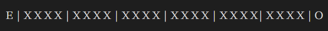
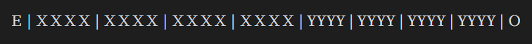

# 240603-韦根协议 Wiegand

韦根协议是一种数据传输协议，常常应用在门禁控制系统中，实现读卡器和控制器之间的通信。

## 物理层

韦根接口的物理层使用三根线，其中两根 D0、D1 为数据线，一根为地线。

- 当没有数据被发送的时候，D0 和 D1 都被上拉至高电平，通常为+5VDC
- 当 0 被发送的时候，D0 出现负脉冲，D1 会保持在高电平
- 当 1 被发送的时候，D1 出现负脉冲，D2 会保持在高电平

## 协议

### 韦根 26 码

- E 为 bit1 ~ bit12的偶校验
- X 为三个字节的卡号信息
- O 为 bit13 ~ bit24的奇校验

### 韦根 34 码

- E 为 bit1 ~ bit16的偶校验
- X 为 ID 卡两个字节的 HID 码（Hidden ID code）
- Y 为 ID 卡两个字节的 PID 码（Public ID code）
- O 为 bit17 ~ bit32 的奇校验

