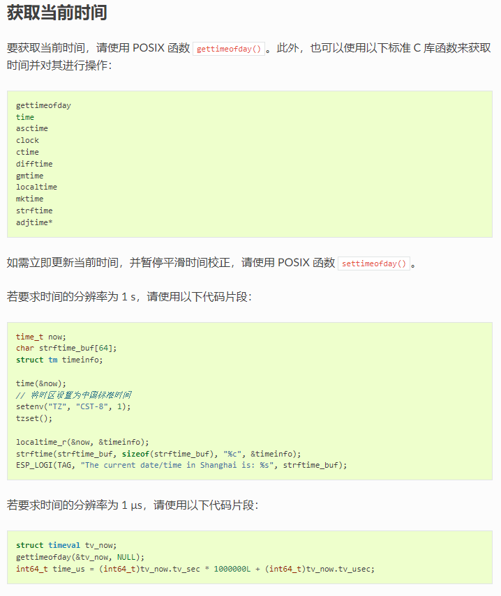
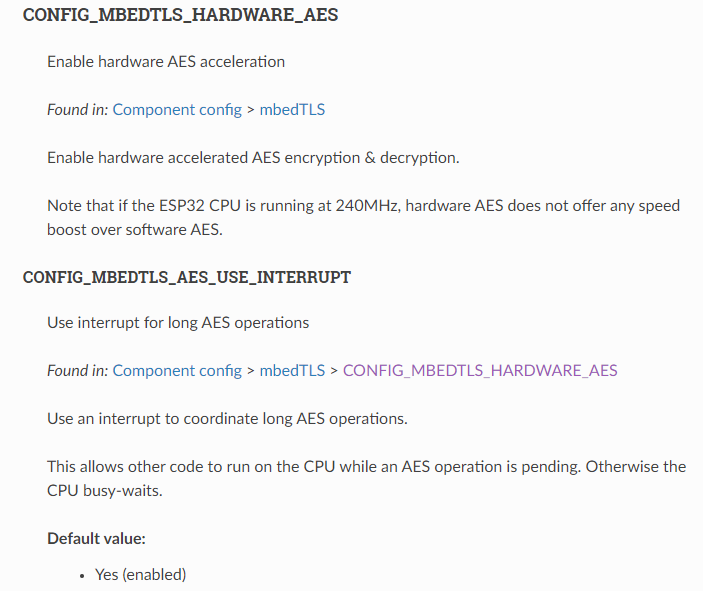
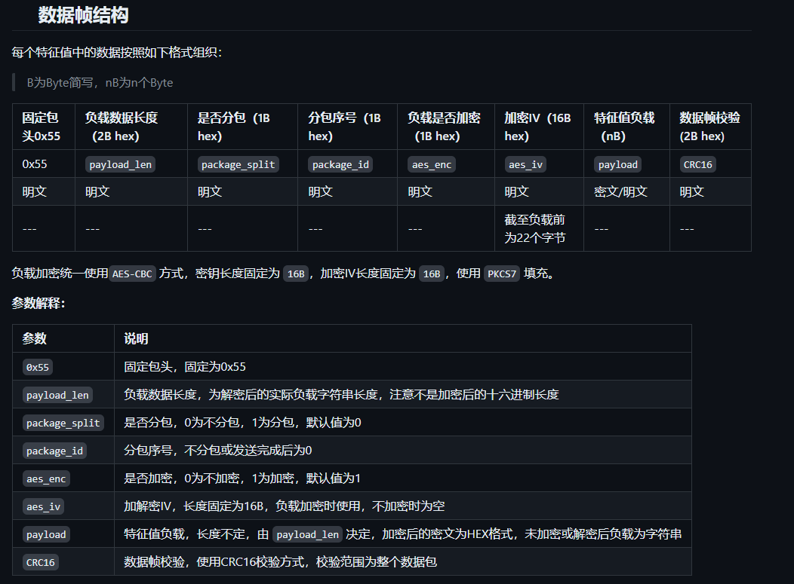

# 240618-SNTP 获取时间、AES 加密

## 1 SNTP 获取时间

>参考博客： https://blog.csdn.net/qq_41741344/article/details/120117151

>官方文档： https://docs.espressif.com/projects/esp-idf/zh_CN/latest/esp32s3/api-reference/system/system_time.html#sntp

SNTP for Simple Network Time Protocol. 是 NTP 协议的一个子集

NTP 时间戳是该协议的重要内容，是一个 64 位无符号浮点数组成，前面 32 位表示整数，后面 32 位表示小数。单位是秒。时间是相对于 1900 年 1 月 0 点开始到现在所经过的秒数。它能表示的最大数字是 4,294,967,295 秒。嵌入式设备上电后连接 AP 获取 IP 地址之后，可以通过 SNTP 的协议获取全球时间。

LwIP 的 SNTP 库中含有一些 API 可以更新系统时间，但是并非为线程安全的 API，官方推荐使用 `esp_netif_component` 来更新时间

具体开发上在 wifi 那边获取到 ip 之后按照如下方式调用并设置 sntp 服务器即可开启 sntp 服务：
```c
static void esp_initialize_sntp(void)
{
    ESP_LOGI(TAG, "Initializing SNTP");
    sntp_setoperatingmode(SNTP_OPMODE_POLL);
    sntp_set_sync_mode(SNTP_SYNC_MODE_IMMED);
    sntp_setservername(0, "s1b.time.edu.cn");
    sntp_setservername(1, "210.72.145.44");
    sntp_setservername(2, "ntp1.aliyun.com");
    sntp_init();
}
```

随后调用 POSIX 函数 `setenv` 和 `tzset` 设置时区以及更新 C 库的运行数据。

完成上述操作之后可以调用如下函数获取本地时间：

- `localtime`，在调用 `time(NULL)` 后可以使用这个函数将 `time_t` 转换为 `tm` 结构体
- `localtime_r`，跟上面相同，但由于不带 `_r` 的返回的是一个指向静态变量的指针，因此有可能被覆盖，特别是多线程环境下



> 注意: sntp 依赖套接字, 因此维护的 sntp 应用需要监听 wifi 事件


## 2 AES 加密

>参考博客: https://blog.csdn.net/qq_36347513/article/details/120991568

>idf 集成的 mbedtls 加密库的 API 参考： https://mbed-tls.readthedocs.io/projects/api/en/v3.4.1/api/file/aes_8h/#_CPPv416mbedtls_aes_initP19mbedtls_aes_context

乐鑫 esp-idf 框架集成开源的 mbedtls 加密库。Mbedtls 也许是最小巧的 SSL 代码库。高效、便于移植和集成。支持常见的安全算法，如：AES、DES、RSA、ECC、SHA256、MD5、BASE64 等等。除此之外还支持公钥证书体系。它提供了具有直观的 API 和可读源代码的 SSL 库。该工具即开即用，可以在大部分系统上直接构建它，也可以手动选择和配置各项功能。

### 2.1 AES 种类

**ECB 形式**：即电子密码本形式，最早采用并且最简单的方式，将加密的数据分为若干组，每组大小跟加密密钥长度相同。一次只能加解密 128 位的明文，也就是 16 个字节。

**CBC 形式**：即加密块链形式，需要一个初始化向量。

>**什么是初始化向量？**
>
>在密码学中，初始化向量（Initialization Vector，简称 IV）是一个在加密过程中使用的固定长度的随机或伪随机值。它与第一个块的明文一起使用，以确保即使相同的明文块多次加密，也会产生不同的密文块，从而增加加密的安全性。
>
>在使用像 AES 这样的块加密算法时，每个数据块（通常是 16 字节）都需要使用密钥进行加密。如果不使用 IV，那么相同的明文块将总是产生相同的密文块，这将使得加密算法容易被攻击。

### 2.2 ESP32 关于 AES 的 menuconfig 选项



可以选择打开硬件 AES 加速, 并有如下设置

- `CONFIG_MBEDTLS_AES_USE_INTERRUPT` 
- `CONFIG_MBEDTLS_AES_INTERRUPT_LEVEL`

### 2.3 AES 填充


AES-128-CBC 属于分组对称加密算法：同一组 key 进行明文和密文的转换

使用 16B 为一组进行加密，即明文的 16B 对应一组加密后的 16B 密文。因此 AES-CBC 需要明文为 16B 的倍数，在不满 16B 的时候需要对明文进行填充，通常的填充方法为 PKCS7（Public-Key Cryptography Standards 7）：

当加密到最后一组的时候：若不足 16B 则填充长度为恰好补足到 16B 的长度，填充内容即填充长度值本身；若恰好为 16B 则最后加入一个 16B 的 0x10 组再进行加密。

传入明文、16B 的 key、16B 的初始偏移向量 IV

初始向量和 key 加密第一组数据之后，**会将第一组加密后的密文赋值给 IV**，然后再进行第二组加密，循环直到结束。

### 2.4 Mbedtls 库

使用该库函数之前需要初始化语境（contex）以及设置加解密的密钥

```c
mbedtls_aes_init(&aes_ctx);

mbedtls_aes_setkey_dec(&aes_ctx, aes_key, 128);
mbedtls_aes_setkey_enc(&aes_ctx, aes_key, 128);
```

### 2.5 门禁 AES 任务 API 

```c
uint8_t aes_enc_uint8(mbedtls_aes_context *aes_ctx, uint8_t *input_iv, uint8_t *plain, uint8_t *cipher, size_t *cipher_len)
```

```doxygen
/**
 * @brief AES加密任务，密文输出为uint8_t，HEX格式
 *
 * @param aes_ctx AES上下文
 * @param[in] input_iv 本次加密的偏移量IV
 * @param[in] plain 需要被加密的明文，可不定长，最大不可超过 AES_TASK_MAX_LEN
 * @param[out] cipher 加密后输出的密文，长度与输入的明文长度相同
 * @param[out] cipher_len 加密后输出的密文长度
 *
 * @return 0: 加密成功
 * @return 1: 明文为空
 * @return 2: 明文过长
 *
 * @attention 本函数会自动对输入的明文进行PKCS7填充
 */
```

```c
uint8_t aes_dec_uint8(mbedtls_aes_context *aes_ctx, uint8_t *input_iv, uint8_t *plain, uint8_t *cipher, size_t cipher_len)
```

```doxygen
/**
 * @brief AES解密任务，明文输出为uint8_t，字符串格式
 *
 * @param aes_ctx AES上下文
 * @param[in] input_iv 本次解密的偏移量IV
 * @param[out] plain 解密后输出的明文
 * @param[in] cipher 需要被解密的密文，最大长度不可超过 AES_TASK_MAX_LEN
 * @param[in] cipher_len 需要被解密的密文长度
 *
 * @return 0: 解密成功
 * @return 1: 密文为空
 * @return 2: 密文过长
 * @return 3: 填充错误
 *
 * @attention 本函数会自动对输出的明文移除PKCS7填充
 */
```

以下为根据蓝牙私有协议封装的打包/解包数据帧函数




```c
uint8_t data_frame_packing(uint8_t *payload, size_t payload_len, uint8_t *frame, size_t *frame_len)
```

```doxygen
/**
 * @brief 打包数据帧
 *
 * @param[in] payload 需要加密的特征值负载
 * @param[in] payload_len 特征值长度
 * @param[out] frame 指向数据帧的指针地址
 * @param[out] frame_len 输出的数据帧长度
 *
 * @return 0: 打包成功
 * @return 1: AES密钥设置错误
 * @return 2: 加密错误
 *
 * @note 暂未支持分包操作
 */
```

```c
uint8_t data_frame_unpacking(uint8_t *frame, size_t frame_len, uint8_t *payload, size_t *payload_len)
```

```doxygen
/**
 * @brief 解包数据帧
 *
 * @param[in] frame 接收到的数据帧
 * @param[in] frame_len 数据帧长度
 * @param[out] payload 解密后的特征值负载
 * @param[out] payload_len 特征值负载长度
 *
 * @return 0: 解包成功
 * @return 1: 帧头错误
 * @return 2: AES密钥设置错误
 * @return 3: 解密错误
 * @return 4: CRC校验错误
 *
 * @note 暂未支持分包操作
 *
 */
```

使用时, 应当先维护一个全局变量 `uint8_t aes_key[16] = AES_KEY_DEFAULT;` 用于提供密钥

系统在初始化阶段应当通过读取初始参数获取历史存储过的密钥, 并替换全局变量的默认值.

