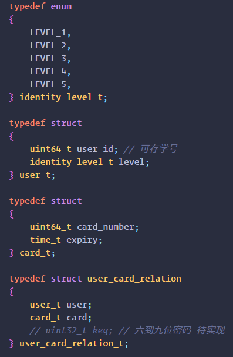

# 240625-卡关系存储设计

门禁系统中的卡号以及人员本地存储设计如下：



最上层定义一个 `user_card_relation_t` ，包含 `user_t` 和 `card_t` 

其中，`user_t` 支持定义学号以及等级；`card_t` 支持定义卡号以及有效期。

该卡关系采用动态内存管理设计，使用上下文以保证操作卡关系时的内存申请与释放，在使用前需要初始化 nvs 模块，并在对卡关系操作完毕后调用释放上下文函数 `free_relations_context`，以下为一个调用示例：
```c
static void relations_test_task(void *pvParameters)
{
    /* RUN ONCE */

    /* 随机创建100条relations存储到nvs中 */
    relations_contex_t ctx;
    init_relations_context(&ctx);

    for (size_t i = 0; i < 100; i++)
    {
        user_card_relation_t relation;
        relation.user.user_id = 202134310000 + i;
        relation.user.level = LEVEL_1;
        relation.card.card_number = 0x0000000000000000 + i;
        relation.card.expiry = time(NULL) + 3600 * 24 * 365 * 2;
        add_relation_contex(&ctx, relation);
    }

    /* 保存到nvs */
    save_relations_nvs(ctx.relations, ctx.relations_count);
    free_relations_context(&ctx);

    /* 读取nvs */
    relations_contex_t ctx2;
    init_relations_context(&ctx2);

    get_relations_nvs(&ctx2.relations, &ctx2.relations_count);

    for (size_t i = 0; i < ctx2.relations_count; i++)
    {
        ESP_LOGI(TAG, "-----------------[RELATIONS GET TEST 1]-----------------");
        ESP_LOGI(TAG, "user_id: %lld, level: %d", ctx2.relations[i].user.user_id, ctx2.relations[i].user.level);
        ESP_LOGI(TAG, "card_number: %lld, expiry: %lld", ctx2.relations[i].card.card_number, ctx2.relations[i].card.expiry);
        ESP_LOGI(TAG, "--------------------------------------------------------");
    }

    free_relations_context(&ctx2);

    vTaskDelete(NULL);
}
```

另外，关于写入卡关系到 nvs 中有如下限制：

```doxygen
/**
 * @brief 添加用户卡关系
 *
 * @param[in] add_relations 输入-要添加的用户卡关系，指向一个结构体数组
 * @param[in] add_relations_count 输入-要添加的用户卡关系数量
 *
 * @return 0: 成功
 * @return 1: 不允许多人一卡
 * @return 2: 分配内存失败
 * @return 3: 保存用户卡关系失败
 *
 * @attention 该函数只需要输入需要添加的关系，函数内部会调用get_user_card_relations获取当前的关系，然后进行比对
 * @attention 若有相同卡号，则更新有效期；若有相同用户但不同卡号，则更新卡号；若没有相同卡号，则添加新关系，最后保存更新到NVS中
 */
```

