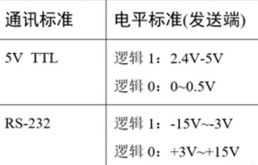
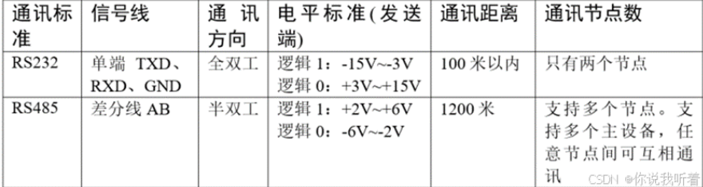
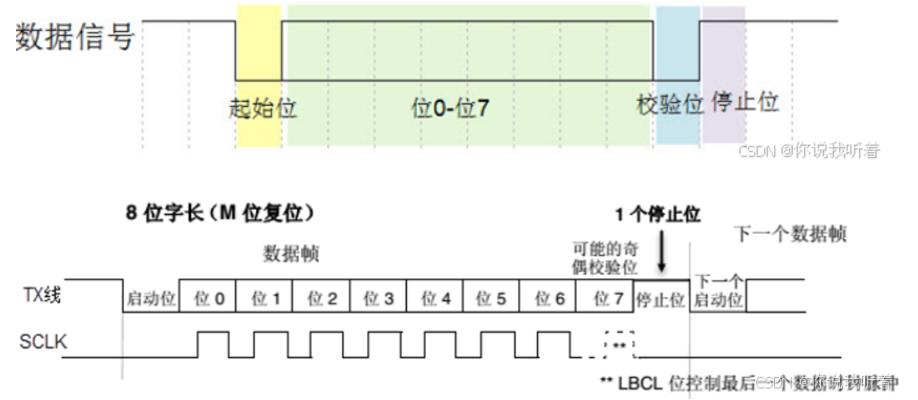
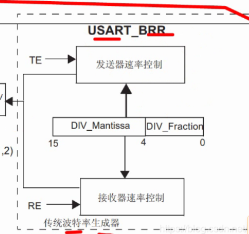
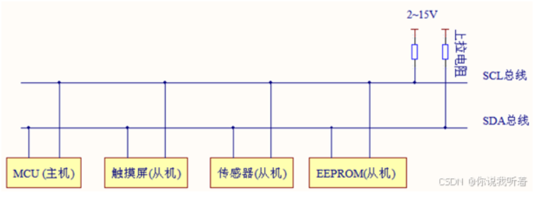
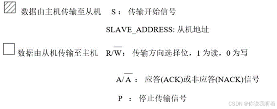
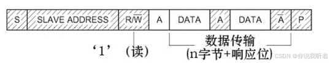
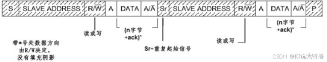
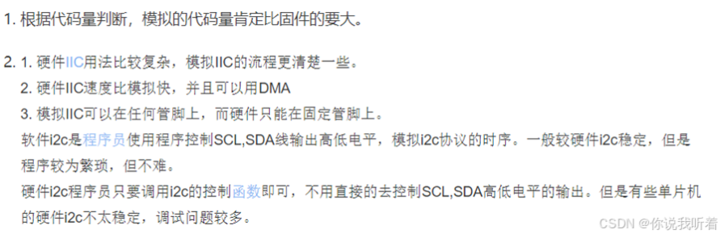
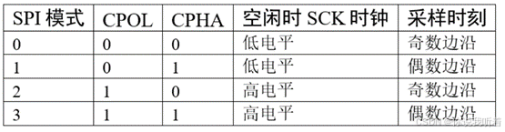

# 240924-通讯协议总结

双工与否？

- **全双工**：在同一时刻，两个设备之间可以同时收发数据
- **半双工**：两个设备之间可以收发数据，但不能在同一时刻进行
- **单工**：在任何时刻都只能进行一个方向的通讯

同步与否？

- 有时钟：同步通信
- 无时钟：异步通信
## 1 RS232

RS232 提高电压后增加了串口通信的传输能力以及抗干扰能力

## 2 RS485

使用一对差分信号线，支持多个节点，多个主设备

## 3 串口通讯协议

- 起始位为低电平，停止信号为高电平
- 有效数据为 5~8 位可配置
- 校验位：奇偶检验

波特率为 `总线时钟 / (16 * BRR)`

## 4 I2C

**物理层：**

由于 I2C 协议是多个主从设备连接到同一根总线上的，因此不能使用推挽输出，因为如果使用了的话会出现某个 IO 口的 Vee 和 GND 连接到一起，出现短路的情况。

使用开漏输出的话就由于上拉电阻的存在可以避免这一问题的出现，但是需要注意开漏输出的高电平没有驱动能力，需要借助外部上拉输出高电平。

I2C 设备空闲时，输出高阻态，所有设备都空闲则都输出高阻态，由上拉电阻把总线拉为高电平。

**协议层：**

- 主机在发送起始信号后所有从机都会接收到，根据协议，接下来发送广播的从机地址信号
- 地址位后的读写位高电平读、低电平写
- 从机接收到匹配的地址之后，只有接收到应答信号后主机才能继续发送或接收数据

**当主机写的时候**

- 从机回复应答信号，主机再发送一个字节，数据传输结束后主机给从机发送通知信号

**当主机读的时候**

- 主机若不想接收数据了的话，主机给从机返回一个非应答信号

第三幅图为复合格式，两段起始信号：

- 主机通过第一次传输的起始信号找到从及设备后，再发送一段数据，这段数据一般用于表示从设备内部的寄存器或存储器地址
- 在第二次传输的时候则为实际读写内容

在 SCL 为低电平时，SDA 无效

## 5 SPI

相比于 I2C 的广播地址选择设备，SPI 多添加了片选线（NSS）低电平有效，高电平为结束信号

在时钟的下降沿进行数据采样。

含有四种通讯模式：

