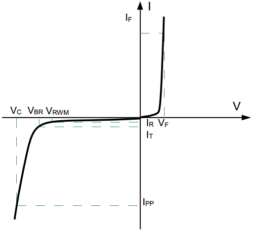
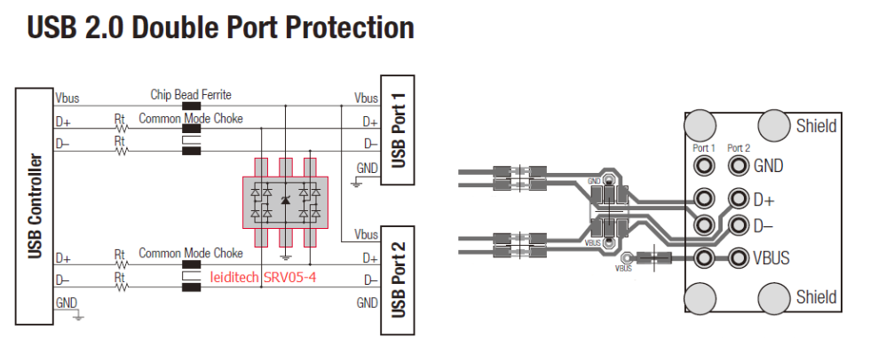

# 241010-硬件设计相关知识

>参考：
> https://blog.csdn.net/karaxiaoyu/article/details/113409410

>EMC：
> https://www.eet-china.com/mp/a330718.html

## 1 EMC 

Electromagnetic Compatibility

EMC = EMI（电磁干扰） + EMS（电磁抗扰）

Electromagnetic Interference
电磁干扰引起的设备、传输通道或系统性能的下降。

Electromagnetic Susceptibility
存在电磁干扰的情况下，装置、设备或系统的抗干扰能力。

电磁干扰的三要素是干扰源、干扰传输途径、干扰接收器。

最基本的干扰抑制技术是屏蔽、滤波、接地。它们主要用来切断干扰的传输途径。

### 1.1 ESD

**请列举三种典型的 ESD 模型。**

人体模型(HBM)、机器模型(MM)、带电器件模型(CDM)。

**请问为何手持便携电子产品，需要在众多输入输出接口加 ESD 器件？您认为选择 ESD 元件的时候需要注意哪些参数？如果一个时钟线加了 ESD 器件之后接口工作不正常，把 ESD 器件去掉之后却能正常工作，您认为是什么原因，应该如何重新选择 ESD 器件？**

手持设备，众多输入输出接口均可能受到静电放电的损害，所以要加ESD保护器件。

ESD 元件的选择需要注意三个参数：正常工作电压、动作嵌位电压和等效电容。如果等效电容过大，会影响信号的工作频率，所以需要根据信号最大工作频率来选择 ESD 器件的等效电容。

### 1.2 TVS

**请简述 TVS（Transient Voltage Suppressors） 瞬态电压抑制二极管的工作原理。**

利用了反向击穿效应：当 TVS 上的电压超过一定幅度时，器件迅速导通，从而将浪涌能量泄放掉，并将浪涌电压限制在一定的幅度。

**选型？**

>选择 TVS 的最高工作电压 Vrwm：

由于电路正常时 TVS 不应工作，应处于截止状态，所以 TVS 的截止电压应大于电路的工作电压。

一般为最高工作电压的 1.1 倍到 1.2 倍

>选择 TVS 的钳位电压 VC

应小于后端电路的最大可承受瞬态安全电压

>选择 TVS 的功率

反应了 TVS 的抗浪涌能力，取决于 Ipp 和 VC

>评估漏电流 IR 的影响

在最大的反向工作电压条件下，流过 TVS 的最大电流，TVS 较小功耗，若应用在高阻抗电路如 ADC 电路中有可能会影响 ADC 的采样值。

>评估结电容的影响

高速通讯的情况下，TVS 的结电容过大则会影响信号的正常通讯

### 1.3 参考设计

SRV05-4 参考

### 1.4 压敏电阻

电压敏感元件，在电路承受过压时进行电压钳位，吸收多余的电流以保护后级电路

## 2 电源

>参考： https://blog.csdn.net/qq_21794157/article/details/122703076

使用过 LM2576 的电源芯片，设计时有几个当时记得的要点：

- 对于电感的选型虽然绕线型的比较便宜，但是容易产生电磁干扰，一体式的较好，电感工作电流也需要大于额定电流
- 输出电容起到输出滤波和保证环路稳定的作用，耐压值也需要注意选型，至少为输出电压的 1.5 倍。
- 续流二极管应使用低压降的肖特基二极管

### 2.1 调制方式

**PFM 频率调制方式**

开关的脉冲宽度一定，改变脉冲输出的频率使得电压稳定

适合长时间小负载的工况，耗电较小

**PWM 宽度调制方式**

开关的脉冲频率一定，改变脉冲输出的宽度使得电压稳定

效率较高，纹波以及噪声较小

**不同点**

一般小负载常用 PFM，重负载常用 PWM

### 2.2 工作模式

- CCM：电感电流连续工作模式
- DCM：电感电流不连续工作模式
- BCM：电感电流连续工作模式（周期结束时电感电流刚好降为 0）
### 2.3 架构方式

伏秒平衡原理：在稳态工作的开关电源中电感两端的正伏秒值等于负伏秒值

**BUCK**

开关导通的时候输入电压加到 LC 滤波器的输入段，电感电流以固定斜率线性上升

**BOOST**

开关管导通时：电感中的电流呈线性增加，电感自感阻碍电流上升，将电能转化为磁能存储起来，二极管用于防止电容对地放电

开关管关闭时：电感的电流缓慢减少，自感作用阻碍电流减少，电感两端左负右正，因此输出端的电压为输入电压加电感产生的电压，输出电压大于输入电压

**BUCK-BOOST**

注意输出电容极性向下

## 3 PCB 绘制经验

PCB 首先先要按照外壳要求设计 PCB 板的形状与确定定位孔的位置，要保证板以及板上的器件不会与外壳产生干涉。设计好形状后便开始布局，PCB 的布局遵循“特殊优先，先难后易，先大后小”的规则。在本项目中需要预留电磁阀与流量计的接口，由于前者分脉冲型电磁阀与直流电磁阀，后者需要 24V 供电以及脉冲输出，因此都选用间距 5.81mm 的 3Pin 螺钉式端子；还要预留 PCB 总 24V 输入接口与 24V 输出接口，且两个接口既需要搭载电源输入/输出，同时也作为 485 通信的接口，故选用间距为 5.81mm 的 4Pin 螺钉式端子。考虑到接线的方便，故将接口放置在外壳的防水接口处。其次，本 PCB 板还预留了单片机程序烧录接口、串口调试接口、I2C 接口等，以方便后续的调试以及提高适配性。皆选用 KF2510 系列的接口，防止反接导致元器件受损。确定接口位置后，便根据接口的位置放置对应的元器件，以达到走线距离最短最方便，阻抗最低的目的，提高信号的稳定性以及完整性。

优先布置电源模块，电路稳定工作的前提是供电稳定且正常，故电源电路的布局与走线尤为重要。本项目的电源从接口输入，先经过 TVS 与自恢复保险丝，再经过 330uF 的大电容滤除低频噪声分量，后经过 1uF 小电容滤除高频噪声分量，先后顺序不得调换。滤波后的电源进入开关电源芯片，芯片将 24V 降至 5V 输出，再经过后续的 LC 电路进行滤波，最后经过 LDO 电路输出 3.3V，给单片机供电。其中，开关电源的续流二极管要尽量靠近引脚摆放，且要保证整个开关电源的地线连接可靠。双层板铺铜的话则要保证 PCB 顶层和底层都要要有一块较大完整的铜皮，且多打孔将两层的铜皮都连接起来。电感作为开关电源中的功率元件，工作时会产生大量的热，需要考虑其散热问题，可通过添加大面积的填充来增加其散热面积，亦可将电感周围的铺铜区域挖空，防止对电路进行干扰。

接着布置主控单片机电路，由于主控单片机的的走线最为复杂，经常需要交叉走线或换层，因此需要把它放在板子中心位置。主控单片机的晶振电路需要靠近单片机的晶振引脚，且需要做包地处理，防止干扰。其滤波电容需要靠近 IC 引脚摆放才能使滤波效果达到最好。对于 485 电路，则最好将 TXD 与 RXD 两条线尽量靠近，等长摆放，最好走差分线。由于终端以及网关都是放在室外的，因此会用防浪涌器件保护电路，防止电路被静电破坏，防浪涌器件要靠近被保护对象，且位于干路上。并且要保证它的电线又粗又短，接地要可靠。

在本项目中，为了能够更好的控制电磁阀，采用了继电器进行控制。继电器驱动电路最好与其它电路分隔开，因为担心它会对其它电路产生干扰，所以最好与其它电路保持距离，以及尽量不要在其周围铺铜，不然可能会导致干扰通过铜皮耦合到其它电路当中。

## 4 差模干扰的消除？

✅参考答案：

差模干扰（common mode interference）是指同时作用于两个信号线上的噪声，它们的大小相等，方向相反，形成一个共同的信号噪声。差模干扰不仅会影响信号的质量，还会导致系统的稳定性和可靠性降低。

模干扰的消除可以采取以下几种措施：

采用差分信号传输方式：在差分传输方式下，两条信号线之间的[差分模式](https://zhida.zhihu.com/search?content_id=226759639&content_type=Article&match_order=1&q=%E5%B7%AE%E5%88%86%E6%A8%A1%E5%BC%8F&zhida_source=entity)信号可以有效地抵消差模干扰信号，从而使信号传输更加稳定和可靠。

添加共模抑制电路：共模抑制电路是一种专门用来消除差模干扰的电路，它可以在输入信号上添加一些特定的电路，以达到抑制差模干扰的目的。

加强地线的连接：地线的连接质量直接影响系统中差模信号的抑制效果。加强地线的连接可以有效地降低系统中的差模干扰。

优化 PCB 设计：差模干扰往往与信号传输线的长度、布线方式、PCB 层次等因素有关。因此，在 PCB 设计中，可以采用更加合理的布线方式、减少线长、优化 PCB 层次等措施来消除差模干扰。

**二、MOSFET 主要参数和选型**
MOSFET 的主要参数有 Id（最大漏源电流）, Idm（最大脉冲漏源电流），Vgs（最大栅源电压）, V（BR）DSS（漏源击穿电压）, Rds (on)（导通电阻） ,Vth（阈值电压）等。在做器件选型时，主要从以下几个方面考虑：

1、是 N-MOS 还是 P-MOS：N-MOS 性价比高
（1）从电路结构上看，低压侧开关选 N-MOS，高压侧开关选 P-MOS；

（2）从成本和便利性上看，N 沟道 MOSFET 选择的型号多，物料成本低；P 沟道 MOSFET 选择的型号较少，物料成本高；

（3）从性能上看，NMOS 导通电阻小，发热量更低，允许通过的电流大，应用场景也更广泛，正激，反激、推挽、半桥、全桥等拓扑电路都能应用；

2、选取封装类型：SMT 器件生产效率高
（1）温升和热设计是选取封装最基本的要求，基本原则就是在保证 MOSFET 的温升和系统效率的前提下，选取参数和封装更通用的型号；

（2）系统的结构尺寸限制；

（3）功耗或散热方面的需求；

（4）生产、装配、维修的效率和便利性；

图 3：MOSFET 的常见封装

3、选取耐压 BVdss：预留足够的余量
（1）产品的额定电压是固定的，MOSFET 的耐压选取也就比较容易，由于 BVdss 具有正温度系数，在实际的应用中要结合这些因素综合考虑。

（2）VDS 中的最高尖峰电压如果大于 BVdss，即便这个尖峰脉冲电压的持续只有几个或几十个 ns，MOSFET 管也会进入雪崩击穿状态而发生损坏。

（3）因此 MOSFET 管的雪崩电压通常发生在 1.2～1.3 倍的 BVDSS，而且持续的时间通常都是μs、甚至 ms 级，因此在选择 BVdss 时需要留有足够的余量。

4、选取 Id 电流：预留足够的余量
（1）Id 电流代表 MOSFET 能流过的最大电流，反映带负载能力，超过这个值可能会因为超负荷导致 MOSFET 损坏。

（2）Id 电流参数选择时，需要考虑连续工作电流和电涌带来的尖峰电流，确保 MOSFET 能够承受最大的电流值。

（3）Id 电流具有负温度系数，电流值会随着结温度升高而降低，因此应用时需要考虑的其在高温时的 Id 值能否符合要求。

5、选取栅极阈值电压 Vth：需结合电路需求选择
（1）Vth 是指当源极与漏极之间有指定电流时，栅极使用的电压；

（2）Vth 具有负温度系数，选择参数时需要考虑。

（3）不同电子系统选取 MOSFET 管的阈值电压 Vth 并不相同，需要根据系统的驱动电压，选取合适阈值电压的 MOSFET 管。

（4）阈值电压越高抗干扰性能越强，可以减少尖峰脉冲造成的电路误触发。

6、选取导通电阻 Rds（on）：越低越好
（1）Rds（on）和导通损耗直接相关，RDSON 越小，功率 MOSFET 的导通损耗越小、效率越高、工作温升越低。

（2）Rds（on）时正温度系数，会随着 MOSFET 温度升高而变大，也就是 Rds（on）电阻值会随着电流增大轻微上升，因此选择时需要留有余量。

（3）Rds（on）低的 MOSFET 通常成本比较高，可以通过优化驱动电路，改进散热等方式，选用 Rds（on）较大一些的的低成本器件。

7、选取寄生电容/栅电荷：Ciss、Coss、Crss；Qg、Qgd、Qoss：越小越好
（1）影响开关性能参数，最重要的是 Ciss、Coss 和 Crss 的电容，这些电容在工作时重复充放电产生开关损耗，导致 MOSFET 开关速度下降，效率降低。

（2）栅电荷反映存储在端子间的电荷，在开关电路工作时，电容上的电荷会随着电压变化，因此设计栅极驱动电路时需要考虑栅极电荷的影响。

8、热设计：按照最坏情况来设计
（1）确保 MOSFET 工作在开关状态，关注封装的半导体结与环境之间的热阻，以及最高的结温。

（2）设计人员需充分考虑最坏情况和真实情况，建议采用针对最坏情况的计算结果，确保系统不会失效。

（3）如果系统允许，尽量加大散热器尺寸和选用更好的散热方式，提升系统工作稳定性。

9、其他：
MOSFET 选型时还需要关注开关时间（ton、toff）、内部寄生二极管、低频跨导 gm 等参数。

