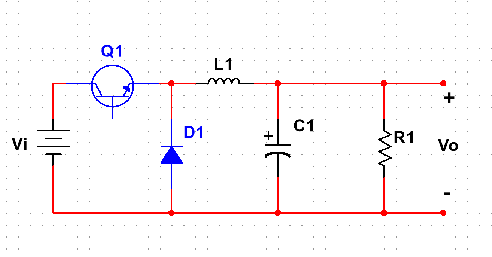
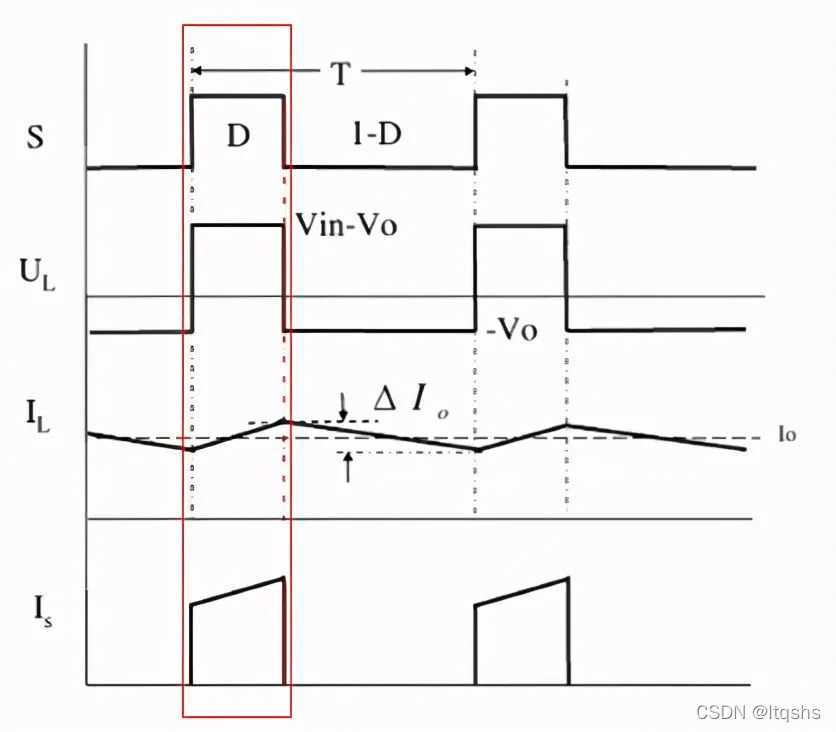
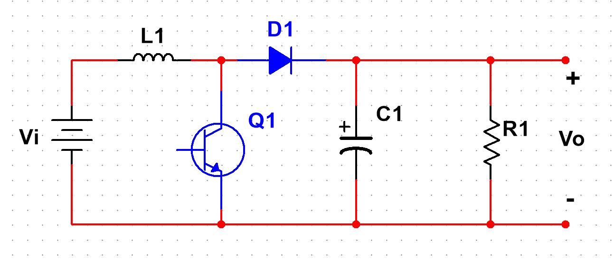
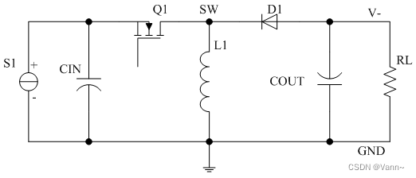

# 项目整理

## 1 无人机

### 1.1 电源            

LM2576 电源芯片，主要参数为宽输入电压范围，可达 40V，大额定输出电流 3A。
输出电压取决于所用的 LM2576 具体型号，

为克服工作在电源效率较低、散热困难等确定，可以使电路中的调整管工作在开关状态，因为管饱和的时候管压降和截止电流都很小，管耗一般发生在状态开关的转换过程中，电源效率可以大幅提高。

主要缺点为输出电压的纹波较大。

### 1.2 主控 

使用 STM32F407 作为系统的主控，在前期设计了最小系统板的可更换方案，拓展出大量接口

使用 apriltag 定位，openmv 识别 apriltag 后通过自定串口协议发送给主控，同时激光测距以及凌霄 IMU 也通过串口发送数据给无人机主控，四轮小车和无人机的主控之间采用无线串口进行通信，并在四轮小车搭载的屏幕上显示航迹

## 2 灭火网关

### 2.1 电源

>参考： https://blog.csdn.net/qq_21794157/article/details/122703076

#### 2.1.1 调制方式

**PFM 频率调制方式**

开关的脉冲宽度一定，改变脉冲输出的频率使得电压稳定

适合长时间小负载的工况，耗电较小

**PWM 宽度调制方式**

开关的脉冲频率一定，改变脉冲输出的宽度使得电压稳定

效率较高，纹波以及噪声较小

**不同点**

一般小负载常用 PFM，重负载常用 PWM

#### 2.1.2 工作模式

- CCM：电感电流连续工作模式
- DCM：电感电流不连续工作模式
- BCM：电感电流连续工作模式（周期结束时电感电流刚好降为 0）
#### 2.1.3 架构方式

伏秒平衡原理：在稳态工作的开关电源中电感两端的正伏秒值等于负伏秒值

**BUCK**

开关导通的时候输入电压加到 LC 滤波器的输入段，电感电流以固定斜率线性上升

**BOOST**

开关管导通时：电感中的电流呈线性增加，电感自感阻碍电流上升，将电能转化为磁能存储起来，二极管用于防止电容对地放电

开关管关闭时：电感的电流缓慢减少，自感作用阻碍电流减少，电感两端左负右正，因此输出端的电压为输入电压加电感产生的电压，输出电压大于输入电压

**BUCK-BOOST**

注意输出电容极性向下

