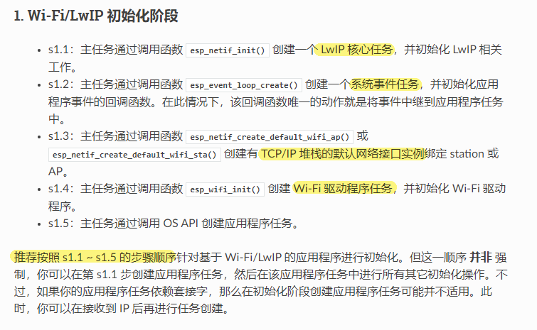
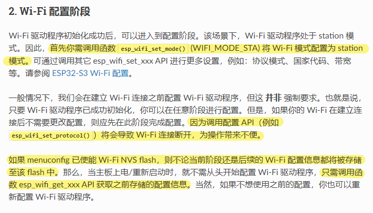
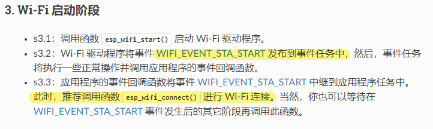
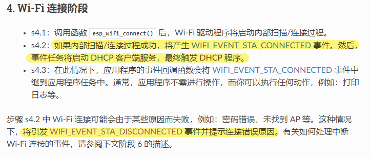
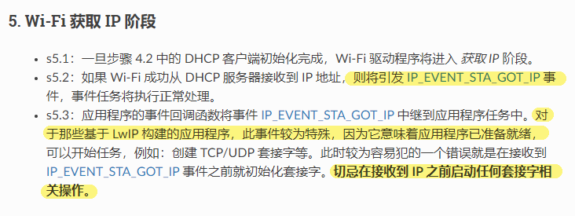
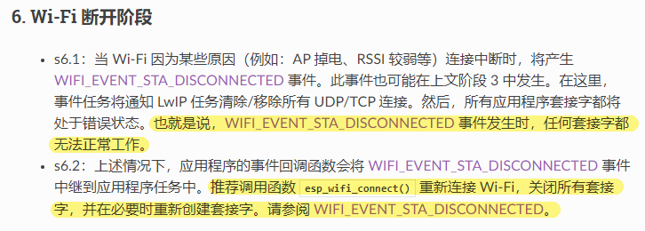
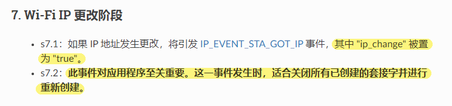
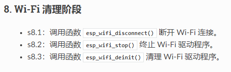

# 240617-IDF 的事件循环，及 wifi 运行流程

## 1 事件循环

>API 参考： https://docs.espressif.com/projects/esp-idf/zh_CN/v5.2.2/esp32s3/api-reference/system/esp_event.html

>wifi 使用的事件循环，参考博客： https://blog.csdn.net/m0_63235356/article/details/137833228

类似于 FreeRTOS 的事件组，IDF 提供了一个事件循环库，使得组件之间可以相互监听事件的发生或发布事件。

IDF 维护一个特殊的事件循环，被称作 `默认事件循环` 。该循环用于处理各种常见的系统事件。用户不能操作该循环的句柄，所有的操作都通过事件循环的变体 API 完成，下表为变体与原本的 API 对照：

| 用户事件循环                                                                                                                                                                                                                                                                                                | 默认事件循环                                                                                                                                                                                                                                                        |
| ----------------------------------------------------------------------------------------------------------------------------------------------------------------------------------------------------------------------------------------------------------------------------------------------------- | ------------------------------------------------------------------------------------------------------------------------------------------------------------------------------------------------------------------------------------------------------------- |
| [`esp_event_loop_create ()`]( https://docs.espressif.com/projects/esp-idf/zh_CN/v5.2.2/esp32s3/api-reference/system/esp_event.html#_CPPv421esp_event_loop_createPK21esp_event_loop_args_tP23esp_event_loop_handle_t "esp_event_loop_create")                                                          | [`esp_event_loop_create_default ()`]( https://docs.espressif.com/projects/esp-idf/zh_CN/v5.2.2/esp32s3/api-reference/system/esp_event.html#_CPPv429esp_event_loop_create_defaultv "esp_event_loop_create_default")                                            |
| [`esp_event_loop_delete ()`]( https://docs.espressif.com/projects/esp-idf/zh_CN/v5.2.2/esp32s3/api-reference/system/esp_event.html#_CPPv421esp_event_loop_delete23esp_event_loop_handle_t "esp_event_loop_delete")                                                                                    | [`esp_event_loop_delete_default ()`]( https://docs.espressif.com/projects/esp-idf/zh_CN/v5.2.2/esp32s3/api-reference/system/esp_event.html#_CPPv429esp_event_loop_delete_defaultv "esp_event_loop_delete_default")                                            |
| [`esp_event_handler_register_with ()`]( https://docs.espressif.com/projects/esp-idf/zh_CN/v5.2.2/esp32s3/api-reference/system/esp_event.html#_CPPv431esp_event_handler_register_with23esp_event_loop_handle_t16esp_event_base_t7int32_t19esp_event_handler_tPv "esp_event_handler_register_with")     | [`esp_event_handler_register ()`]( https://docs.espressif.com/projects/esp-idf/zh_CN/v5.2.2/esp32s3/api-reference/system/esp_event.html#_CPPv426esp_event_handler_register16esp_event_base_t7int32_t19esp_event_handler_tPv "esp_event_handler_register")     |
| [`esp_event_handler_unregister_with ()`]( https://docs.espressif.com/projects/esp-idf/zh_CN/v5.2.2/esp32s3/api-reference/system/esp_event.html#_CPPv433esp_event_handler_unregister_with23esp_event_loop_handle_t16esp_event_base_t7int32_t19esp_event_handler_t "esp_event_handler_unregister_with") | [`esp_event_handler_unregister ()`]( https://docs.espressif.com/projects/esp-idf/zh_CN/v5.2.2/esp32s3/api-reference/system/esp_event.html#_CPPv428esp_event_handler_unregister16esp_event_base_t7int32_t19esp_event_handler_t "esp_event_handler_unregister") |
| [`esp_event_post_to ()`]( https://docs.espressif.com/projects/esp-idf/zh_CN/v5.2.2/esp32s3/api-reference/system/esp_event.html#_CPPv417esp_event_post_to23esp_event_loop_handle_t16esp_event_base_t7int32_tPKv6size_t10TickType_t "esp_event_post_to")                                                | [`esp_event_post ()`]( https://docs.espressif.com/projects/esp-idf/zh_CN/v5.2.2/esp32s3/api-reference/system/esp_event.html#_CPPv414esp_event_post16esp_event_base_t7int32_tPKv6size_t10TickType_t "esp_event_post")                                          |

## 2 IDF 中的 wifi 运行逻辑

>官方 wifi 驱动程序指南，罗列了默认事件循环中的 wifi 事件： https://docs.espressif.com/projects/esp-idf/zh_CN/v5.2.2/esp32s3/api-guides/wifi.html#id6

>官方关于 wifi 的 demo ： https://github.com/espressif/esp-idf/tree/v5.2.2/examples/wifi

### 2.1 初始化

LwIP for Lightweight TCP/IP stack

LwIP 性能要求只有数十 KB 可用 RAM 和大致 40KB 可用 ROM 空间即可

这一阶段没有什么需要改动的，注意一下初始化顺序就好，套接字一般在获得到 IP 之后再创建

### 2.2 配置

需要注意调用配置 API 之后会将 wifi 断开，一般在建立连接之前配置wifi

### 2.3 启动

启动 wifi 驱动程序，此时会发布一个 `WIFI_EVENT_STA_START` 的事件，可以在该事件发生之后调用函数进行 wifi 的连接

### 2.4 连接

调用 connect 函数之后将会触发 `CONNECTED` 事件，并由默认事件循环启动 DHCP 客户端服务，开始尝试获取 IP

>DHCP 协议使用 UDP 作为传输协议，客户端向服务端发送请求，服务端应答。客户端广播 DHCP DISCOVER 报文给服务端，此时，与客户端在同一个网段的 DHCP 服务端才可以接收到报文，如果不在的话需要 DHCP 中继

>总之 DHCP 服务端会给客户端分配一个 IP，一般局域网路由器默认开启 DHCP 服务端功能

对于一个健壮的 wifi 应用程序来说，此时注意要处理可能发生的 `DISCONNECTED` 事件，一旦发生 `DISCONNECTED` 事件，默认事件循环任务将会移除所有 UDP/ICP 连接，此时所有套接字失效。

如阶段 6 所推荐的一样，此时应当再次调用连接函数：移除所有套接字，并尝试重新连接 wifi

### 2.5 获取 IP

这个阶段需要注意的就是一点，即 **在接收到 IP 之后再进行所有的套接字创建等相关操作**

### 2.6 断开处理

如上文 1.4 所述

### 2.7 IP 更改

IP 地址发生更改时也类似 `DISCONNECTED` 事件一样，推荐关闭所有已创建的套接字进行重新创建

### 2.8 清理

