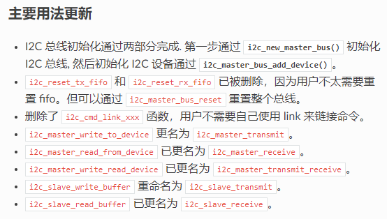

# 240626-BM8563 驱动移植，IDF-I2C 笔记

>官方 I2C 文档： https://docs.espressif.com/projects/esp-idf/zh_CN/latest/esp32s3/api-reference/peripherals/i2c.html

在 IDFv5.2 之后 I2C 进行了更新，主要改动为从机与主机进行了区分；并在老板驱动中，需要一个一个指令通过调用函数的方法连接成链表，现在可以直接调用相关的函数即可



## 1 BM8563 移植接口

以下为接口调用示例：
```c
static void bm8563_test_task(void *pvParameters)
{
    ESP_LOGI(TAG, "-----------[BM8563 test start...]-----------");

    rtc_date_t test_date;
    test_date.year = 2024;
    test_date.month = 6;
    test_date.day = 26;
    test_date.hour = 12;
    test_date.minute = 0;
    test_date.second = 0;
    bm8563_setTime(&test_date);

    rtc_date_t test_date2;
    bm8563_getTime(&test_date2);

    ESP_LOGI(TAG, "Get time: %d-%d-%d %d:%d:%d", test_date2.year, test_date2.month, test_date2.day, test_date2.hour, test_date2.minute, test_date2.second);

    // bm8563_setDateIRQ(1, 1, 1, 1);

    // int16_t ret_BM1 = bm8563_setTimerIRQ(2500);
    // ESP_LOGI(TAG, "Set timer IRQ: %d", ret_BM1);

    // int16_t ret_BM2 = bm8563_getTimerTime();
    // ESP_LOGI(TAG, "Get timer time: %d", ret_BM2);

    // uint8_t ret_BM3 = bm8563_getIRQ();
    // ESP_LOGI(TAG, "Get IRQ: %d", ret_BM3);

    // bm8563_clearIRQ();

    ESP_LOGI(TAG, "-----------[BM8563 test DONE.]-----------");
    vTaskDelete(NULL);
}
```

