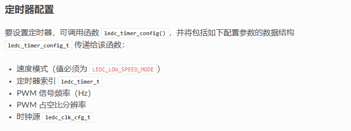
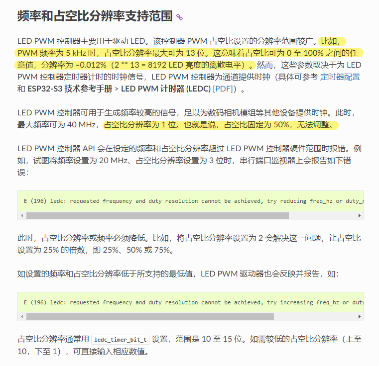
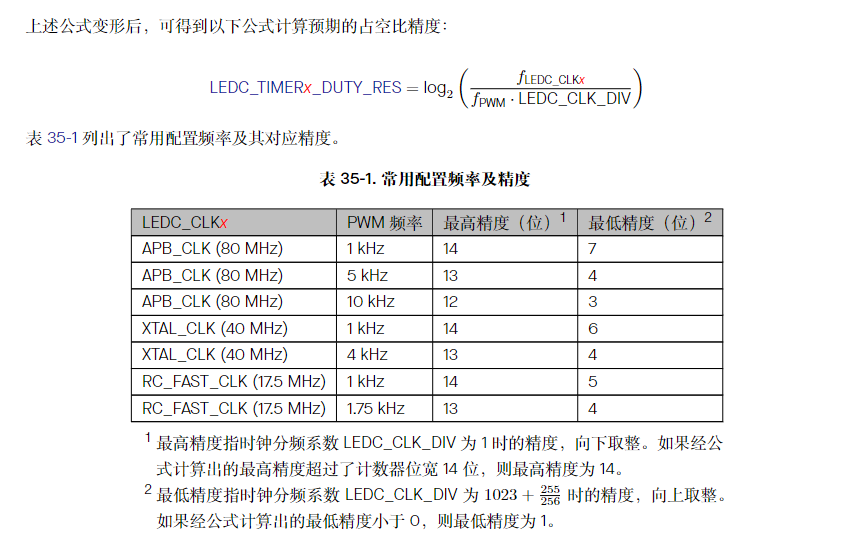
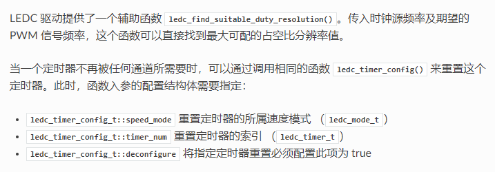
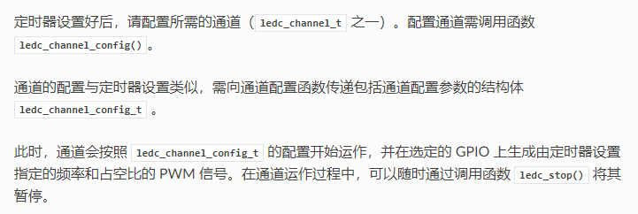

# 240719-LEDPWM及常用指示函数封装

## 1 LEDPWM 笔记

>参考： https://docs.espressif.com/projects/esp-idf/zh_CN/latest/esp32s3/api-reference/peripherals/ledc.html


**——如何配置 LEDC（输出 PWM）**

分三步完成：

- 定时器配置
- 通道配置
- 改变 PWM 信号

### 1.1 定时器配置



若 PWM 频率越高则占空比分辨率则会越低：



除此之外时钟源也可以限制 PWM 的频率，时钟源频率越高，可配置的 PWM 频率上限就越高。常用的 PWM 精度可见技术参考手册：



另外 LEDC 驱动有提供一条辅助函数，可以用于找到最大的可分配占空比分辨率值：



### 1.2 通道配置



### 1.3 改变 PWM 信号

对于 ESP32-S3 来说，LEDPWM 控制器中所有的定时器和通道都只支持低速模式，也就是在通道运行之后若想要改变 PWM 占空比，只能使用软件显式地触发：

```c
esp_err_t ledc_set_duty(ledc_mode_t speed_mode, ledc_channel_t channel, uint32_t duty)
```

在调用上述函数设置新的占空比之后需要调用函数 `ledc_update_duty()` 以使新配置生效，若要查看当前设置的占空比可以使用以下函数进行查看：

```c
uint32_t ledc_get_duty(ledc_mode_t speed_mode, ledc_channel_t channel)
```

除此之外可以再调用一遍 `ledc_channel_config()` 来设置占空比和其他通道参数

### 1.4 实例参考

```c
#define LEDC_TIMER              LEDC_TIMER_0
#define LEDC_MODE               LEDC_LOW_SPEED_MODE
#define LEDC_OUTPUT_IO          (5) // Define the output GPIO
#define LEDC_CHANNEL            LEDC_CHANNEL_0
#define LEDC_DUTY_RES           LEDC_TIMER_13_BIT // Set duty resolution to 13 bits
#define LEDC_DUTY               (4096) // Set duty to 50%. (2 ** 13) * 50% = 4096
#define LEDC_FREQUENCY          (4000) // Frequency in Hertz. Set frequency at 4 kHz
```

```c
static void example_ledc_init(void)
{
    // 初始化一个ledc定时器
    ledc_timer_config_t ledc_timer = {
        .speed_mode       = LEDC_MODE,
        .duty_resolution  = LEDC_DUTY_RES,
        .timer_num        = LEDC_TIMER,
        .freq_hz          = LEDC_FREQUENCY,  // 将输出频率设置为4kHz
        .clk_cfg          = LEDC_AUTO_CLK
    };
    ESP_ERROR_CHECK(ledc_timer_config(&ledc_timer));

    // Prepare and then apply the LEDC PWM channel configuration
    ledc_channel_config_t ledc_channel = {
        .speed_mode     = LEDC_MODE,
        .channel        = LEDC_CHANNEL,
        .timer_sel      = LEDC_TIMER,
        .intr_type      = LEDC_INTR_DISABLE,
        .gpio_num       = LEDC_OUTPUT_IO,
        .duty           = 0, // Set duty to 0%
        .hpoint         = 0
    };
    ESP_ERROR_CHECK(ledc_channel_config(&ledc_channel));
}
```

```c
void app_main(void)
{
    // Set the LEDC peripheral configuration
    example_ledc_init();
    // Set duty to 50%
    ESP_ERROR_CHECK(ledc_set_duty(LEDC_MODE, LEDC_CHANNEL, LEDC_DUTY));
    // Update duty to apply the new value
    ESP_ERROR_CHECK(ledc_update_duty(LEDC_MODE, LEDC_CHANNEL));
}
```

## 2 指示函数调用示例

```c
static void indicate_test_task(void *pvParameters)
{
    ESP_LOGI(TAG, "-----------[INDICATE test start...]-----------");

    indicate_GLED_setting(LEDC_DUTY_100P);
    indicate_YLED_setting(LEDC_DUTY_100P);
    vTaskDelay(1000 / portTICK_PERIOD_MS);
    indicate_YLED_setting(0);
    indicate_GLED_setting(0);
    vTaskDelay(1000 / portTICK_PERIOD_MS);
    indicate_GLED_setting(LEDC_DUTY_50P);
    indicate_YLED_setting(LEDC_DUTY_50P);

    vTaskDelay(1000 / portTICK_PERIOD_MS);

    note_t buz_notes[] = {NOTE_C, NOTE_F, NOTE_SILENCE, NOTE_SILENCE, NOTE_C, NOTE_SILENCE, NOTE_F, NOTE_SILENCE, NOTE_F};
    indicate_BUZ_setting(buz_notes, 9, LEDC_DUTY_15P, 200);

    ESP_LOGI(TAG, "-----------[INDICATE test DONE.]-----------");

    vTaskDelete(NULL);
}
```