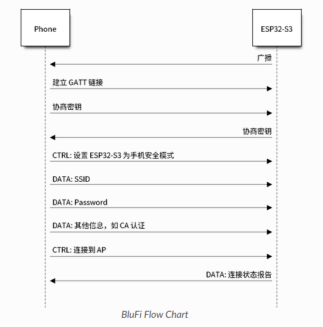
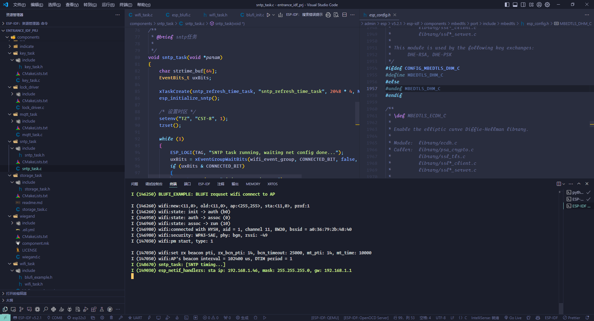
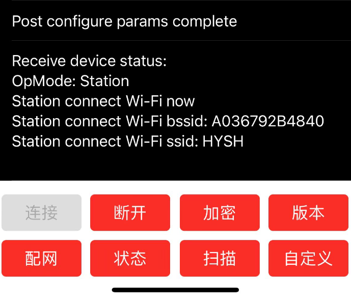
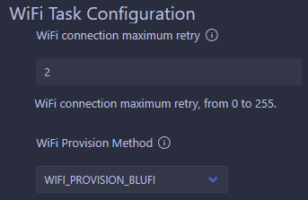

# 240818-蓝牙配网以及 softAP 方式配网探索

**ESP32 端参考：**

>官方统一配网文档： https://docs.espressif.com/projects/esp-idf/zh_CN/latest/esp32s3/api-reference/provisioning/provisioning.html#id1

>blufi 官方 API 指南： https://docs.espressif.com/projects/esp-idf/zh_CN/latest/esp32s3/api-guides/ble/blufi.html?highlight=blufi

> BluFi 蓝牙配网接口参考博客： https://blog.csdn.net/qq_36347513/article/details/118968576

>BluFi 蓝牙参考例程： https://github.com/espressif/esp-idf/tree/d7ca8b94c852052e3bc33292287ef4dd62c9eeb1/examples/bluetooth/blufi

**小程序端参考**

>BluFi 微信小程序配网参考工程 1： https://github.com/xuhongv/BlufiEsp32WeChat

>小程序参考工程 1 的参考博客： https://blog.csdn.net/Boantong_/article/details/115666854

## 1 统一配网

## 2 BluFi 配网

配网流程如官方文档上图所示

- ESP32 端打开 GATTS 模式，发送广播数据包，手机作为 GATTC 接入
- 手机端发送数据帧开始进行密钥协商，ESP32 端收到之后开始解析
- 协商结束后，手机向 ESP32 发送控制帧，设置安全模式；
- 设置完成后开始发送联网所需的数据帧
- 发送完成后手机发送控制帧，此时 ESP32 端默认手机已完成必要信息的传输，开始连接 WIFI
- 连接 WIFI 后 ESP32发送 WIFI 连接状态报告至手机，至此配网结束

### 2.1 基于官方例程尝试移植

#### 2.1.1 官方例程结构

**主函数中首先初始化了四个必要的组件：**

- nvs 存储
- wifi 初始化
- 封装函数 blufi 控制器初始化
- blufi_host_and_cb 初始化

**NVS 存储初始化略，没有上游依赖**

**WIFI 初始化：** 

- netif 初始化：网络接口的初始化，保持默认即可
- 创建 ble 配网使用的 wifi 事件组，该事件组中只定了一个 `CONNECTED_BIT` 用来指示获取到 IP 标志联网成功
- 创建默认系统事件循环
- 在 netif 层上创建默认的 sta 模式以及 ap 模式句柄
- 注册 WIFI 事件的回调函数
- 注册 IP 事件的回调函数
- 按默认配置初始化 WIFI，按 STA 模式使能 WIFI，并设置记录 WIFI 连接的相关信息（用于组成发回给手机的数据包）

**blufi 控制器初始化：** 按照默认配置 `BT_CONTROLLER_INIT_CONFIG_DEFAULT` 初始化蓝牙控制器并使能

**blufi_host_and_cb 初始化：** 

- `esp_blufi_host_init`：`blufi_init.c` ，初始化 bluedroid 蓝牙协议栈并使能
- `esp_blufi_register_callbacks`：blufi 组件所属函数，注册 blufi 相关事件的回调函数，该函数接受本次例程文件中定义的几个必要回调函数，并传递给 blufi 组件以供 blufi 配网过程使用——如 blufi 事件回调函数、数据协商处理函数（DH 方式）、加解密处理函数（AES 加密方式）、校验处理函数（CRC 方式）
- `esp_blufi_gap_register_callback`：`blufi_init.c` ，调用了一下 blufi 组件中的相关函数，注册回调函数来广播 blufi 默认的数据包，初始化 blufi 的 profile

结合上述三个组件来看，由于原有系统中本身就需要初始化 bluedroid 协议栈以及 GATTS 服务，因此第二点 blufi 控制器初始化以及第三点中的初始化 bluedroid 蓝牙协议栈可以在初始化 blufi 协议之前就完成。

#### 2.1.2 利用 Kconfig 将原配网实现（smartconfig）配置为可选项

>ESP-IDF 使用基于 [kconfiglib](https://github.com/ulfalizer/Kconfiglib) 的 [esp-idf-kconfig](https://pypi.org/project/esp-idf-kconfig/) 包，而 [kconfiglib](https://github.com/ulfalizer/Kconfiglib) 是 [Kconfig](https://www.kernel.org/doc/Documentation/kbuild/kconfig-language.txt) 系统的 Python 扩展。Kconfig 提供了编译时的项目配置机制，以及多种类型的配置选项（如整数、字符串和布尔值等）。Kconfig 文件指定了选项之间的依赖关系、默认值、组合方式等。

> `Kconfig` 是一种用于配置内核和软件项目的配置语言，广泛应用于 Linux 内核、U-Boot 和其他嵌入式系统项目中。它允许开发者定义配置选项，并通过菜单界面（如 `menuconfig`）进行配置。

通过编写 IDF 组件文件夹下的 `Kconfig.projbuild` 文件，在 IDF Full Clean 之后便可以生成由组件 Kconfig 规定的若干宏。

>此配置将保存在项目根目录的 `sdkconfig` 文件中。借助 `sdkconfig`，**应用程序构建目标将在构建目录中生成 `sdkconfig.h` 文件** ，并使得 `sdkconfig` 选项可用于项目构建系统和源文件。

#### 2.1.3 移植结果

实现 blufi 配网方式；

并可通过 Kconfig 选择配网方式

#### 2.1.4 ToDo

因为是验证性质的移植所以还有很多可以删减的部分，业务逻辑也还有一点不完善，因此后面还需要继续重构，并检查有没有因为更改配网方式导致的其他依赖 WIFI 的应用程序错误运行。

以及还需要与小程序端一起，测试一下不同平台手机的配网成功率以及验证。

