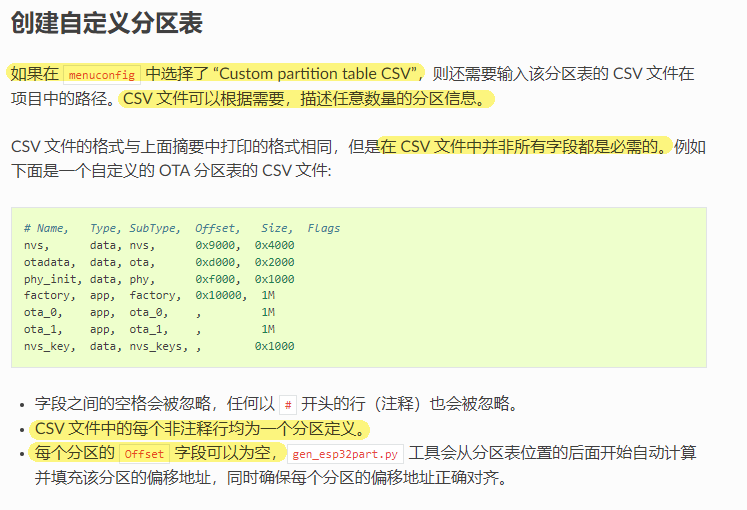
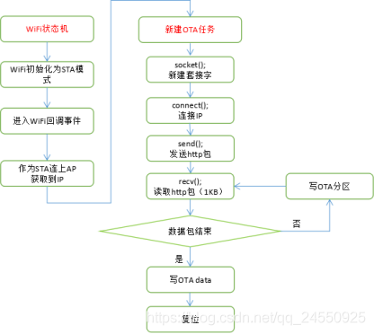
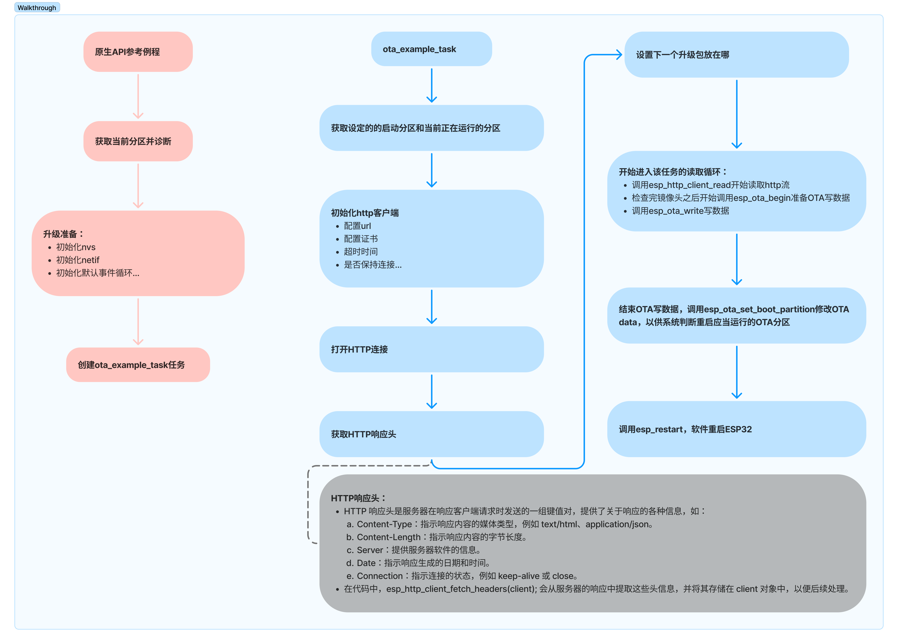
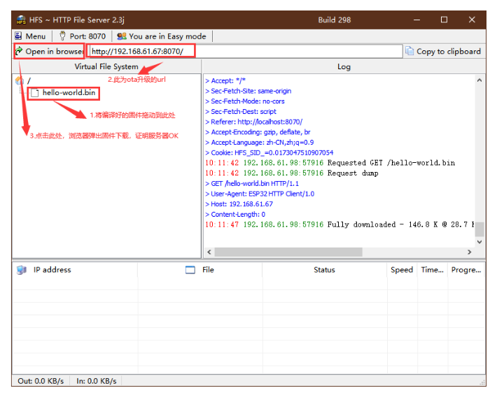

# 240822-ESP32分区表及 OTA

## 1 分区表

>分区表官方文档： https://docs.espressif.com/projects/esp-idf/zh_CN/latest/esp32s3/api-guides/partition-tables.html

分区表中的每个条目都包括以下几个部分：Name（标签）、Type（app、data 等）、SubType 以及在 flash 中的偏移量（分区的加载地址）。


>内置分区表举例

创建自定义分区表：



- Name 字段不能超过 16 个字节
- Type 字段可以指定为 `app` 或 `data` ；这是常用的两个枚举类型，具体完整的存储数据格式可以参考 [`esp_partition_type_t`]( https://docs.espressif.com/projects/esp-idf/zh_CN/latest/esp32s3/api-reference/storage/partition.html#_CPPv420esp_partition_type_t "esp_partition_type_t")
- SubType 字段仅规定 `app` 和 `data` 字段的含义，查阅 [`esp_partition_subtype_t`]( https://docs.espressif.com/projects/esp-idf/zh_CN/latest/esp32s3/api-reference/storage/partition.html#_CPPv423esp_partition_subtype_t "esp_partition_subtype_t")以了解完整的子类型列表
	- Type: app
		- `factory`：
		- `ota_x`：若使用 OTA 的时候至少应当有两个 OTA 应用程序分区；最大可以有 0-15
		- `test`：测试用，预留的子类型；用于工厂测试流程；如果没有其他有效的 app 分区也可以作为备选启动分区进行使用。
	- Type: data
		- `ota`：指定打开的 OTA 应用程序；大小需要设定为 `0x2000` ，容量为两个 flash 扇区的大小，这是为了放置写入的时候电源故障引发问题，两个扇区单独擦除、写入匹配数据，若存在不一致，则用计数器字段判定哪个扇区为最新数据。；参考 [OTA 文档](https://docs.espressif.com/projects/esp-idf/zh_CN/latest/esp32s3/api-reference/system/ota.html) 
		- `phy`：用于存放 PHY 初始化数据；从而保证可以为每个设备配置 PHY
		- `nvs`：非易失性存储；官方建议至少分配 `0x3000` 个字节的空间，如果使用其 API 存储大量数据，默认是 `0x6000` 个字节
		- `nvs_keys`：nvs 的密钥分区

>

实际烧写的分区表不是 csv 文件本身，需要转换为二进制文件。如果在 menuconfig 中设置了分区表 csv 文件的名称的话，利用 idf. py 构建项目将会自动转换。

## 2 OTA 参考

>参考博客： https://blog.csdn.net/qq_36347513/article/details/117819717?spm=1001.2014.3001.5501

>官方 API 参考： https://docs.espressif.com/projects/esp-idf/zh_CN/latest/esp32s3/api-reference/system/ota.html

OTA 详细过程：



**原生 API 的 demo 流程解析：**



### 2.1 创建 HTTP 服务器

#### 2.1.1 Python 方式 

```bash
python -m http.server --bind 192.168.61.67 8070
```

在 build 文件夹下运行上述指令，将会生成一个本地服务器，该服务器下对应 build 文件夹下的所有内容；

#### 2.1.2 HFS 方式

一个可视化工具，大概长这样：



## 3 测试 OTA 移植例程

>更新：2024 年 8 月 24 日

>由于该博客的公开性质，服务器公网 IP 及端口作匿名处理

### 3.1 服务器部署

服务器端不太熟悉，测试流程主要是验证 ESP32 的 OTA 接口，服务器上的测试环境怎么简单怎么来

安装宝塔面板，一键部署 nginx

使用 nginx 部署 http 服务器，打开 autoindex，设置 root 路径：

```json
# nginx的配置文件
server{
	listen xxxx;
	server_name phpmyadmin;
	# index index.html index.htm index.php;
	root  /home/www/esp32bin; # <- 这里是bin文件放置的路径
		location ~ /tmp/ {
			return 403;
		}
	autoindex on;
	autoindex_localtime on; 
	autoindex_exact_size off;
}    
```

结果：


### 3.2 ESP32 端测试结果

```log
--- Using \\.\COM8 instead...
--- esp-idf-monitor 1.4.0 on \\.\COM8 115200 ---
--- Quit: Ctrl+] | Menu: Ctrl+T | Help: Ctrl+T followed by Ctrl+H ---
ESP-ROM:esp32s3-20210327
Build:Mar 27 2021       
rst:0x1 (POWERON),boot:0xb (SPI_FAST_FLASH_BOOT)
SPIWP:0xee
mode:DIO, clock div:1
load:0x3fce3810,len:0x178c
load:0x403c9700,len:0x4
load:0x403c9704,len:0xcbc
load:0x403cc700,len:0x2da0
entry 0x403c9914
I (27) boot: ESP-IDF v5.2.1 2nd stage bootloader
I (27) boot: compile time Aug 23 2024 10:44:26
I (27) boot: Multicore bootloader
I (30) boot: chip revision: v0.2
I (34) boot.esp32s3: Boot SPI Speed : 80MHz
I (38) boot.esp32s3: SPI Mode       : DIO
I (43) boot.esp32s3: SPI Flash Size : 8MB
I (48) boot: Enabling RNG early entropy source...
I (53) boot: Partition Table:
I (57) boot: ## Label            Usage          Type ST Offset   Length
I (64) boot:  0 nvs              WiFi data        01 02 00009000 00006000
I (72) boot:  1 otadata          OTA data         01 00 0000f000 00002000
I (79) boot:  2 phy_init         RF data          01 01 00011000 00001000
I (87) boot:  3 factory          factory app      00 00 00020000 00200000
I (94) boot:  4 ota_0            OTA app          00 10 00220000 00200000
I (102) boot:  5 ota_1            OTA app          00 11 00420000 00200000
I (109) boot: End of partition table
I (113) boot: Defaulting to factory image
I (118) esp_image: segment 0: paddr=00020020 vaddr=3c110020 size=56d8ch (355724) map
I (190) esp_image: segment 1: paddr=00076db4 vaddr=3fc9bb00 size=05094h ( 20628) load
I (195) esp_image: segment 2: paddr=0007be50 vaddr=40374000 size=041c8h ( 16840) load        
I (200) esp_image: segment 3: paddr=00080020 vaddr=42000020 size=103d78h (1064312) map       
I (396) esp_image: segment 4: paddr=00183da0 vaddr=403781c8 size=1382ch ( 79916) load
I (423) boot: Loaded app from partition at offset 0x20000
I (423) boot: Disabling RNG early entropy source...
I (435) cpu_start: Multicore app
I (444) cpu_start: Pro cpu start user code
I (444) cpu_start: cpu freq: 160000000 Hz
I (445) cpu_start: Application information:
I (447) cpu_start: Project name:     entrance_idf_prj
I (453) cpu_start: App version:      v1.0-38-gcc0dfe7-dirty
I (459) cpu_start: Compile time:     Aug 24 2024 17:01:59
I (466) cpu_start: ELF file SHA256:  a8a0453d5...
I (471) cpu_start: ESP-IDF:          v5.2.1
I (476) cpu_start: Min chip rev:     v0.0
I (480) cpu_start: Max chip rev:     v0.99 
I (485) cpu_start: Chip rev:         v0.2
I (490) heap_init: Initializing. RAM available for dynamic allocation:
I (497) heap_init: At 3FCA8AE0 len 00040C30 (259 KiB): RAM
I (503) heap_init: At 3FCE9710 len 00005724 (21 KiB): RAM
I (509) heap_init: At 3FCF0000 len 00008000 (32 KiB): DRAM
I (516) heap_init: At 600FE010 len 00001FD8 (7 KiB): RTCRAM
I (523) spi_flash: detected chip: gd
I (526) spi_flash: flash io: dio
I (530) sleep: Configure to isolate all GPIO pins in sleep state
I (537) sleep: Enable automatic switching of GPIO sleep configuration
I (544) coexist: coex firmware version: 77cd7f8
I (549) coexist: coexist rom version e7ae62f
I (555) main_task: Started on CPU0
I (565) main_task: Calling app_main()
I (565) indicate: indicate_init start
I (565) indicate: indicate_YLED_setting
I (575) indicate: indicate_GLED_on
I (575) indicate: indicate_init end
I (575) indicate: indicate_BUZ_setting
I (1185) gpio: GPIO[7]| InputEn: 1| OutputEn: 1| OpenDrain: 1| Pullup: 1| Pulldown: 0| Intr:0
I (1185) gpio: GPIO[6]| InputEn: 1| OutputEn: 1| OpenDrain: 1| Pullup: 1| Pulldown: 0| Intr:0
I (1185) BM8563: I2C for BM8563 init success
I (1195) BM8563: BM8563 has not lost power, getdata = 03
I (1195) BM8563: BM8563 init success
I (1225) STORAGE_TASK: [CONFIG] Lock delay: 1300000
I (1225) STORAGE_TASK: [CONFIG] AES key: ��V�=�8����1vVJ
I (1235) main: Init value read success
I (1235) BLE_INIT: BT controller compile version [30b57c4]
I (1245) BLE_INIT: Bluetooth MAC: 48:27:e2:8f:2d:7a
I (1245) phy_init: phy_version 640,cd64a1a,Jan 24 2024,17:28:12
W (1315) BT_BTM: BTM_BleWriteAdvData, Partial data write into ADV
I (1315) pp: pp rom version: e7ae62f
W (1315) BT_BTM: BTM_BleWriteScanRsp, Partial data write into ADV
I (1315) net80211: net80211 rom version: e7ae62f
I (1325) GATTS_SERVER_TASK: create attribute table successfully, the number handle = 11
I (1335) wifi:wifi driver task: 3fcc2218, prio:23, stack:6656, core=0
I (1335) GATTS_SERVER_TASK: SERVICE_START_EVT1, status 0, service_handle 40
I (1345) GATTS_SERVER_TASK: advertising start successfully
I (1355) wifi:I (1355) GATTS_SERVER_TASK: create attribute table successfully, the number handle = 3

wifi firmware version: a9f5b59
I (1365) GATTS_SERVER_TASK: SERVICE_START_EVT2, status 0, service_handle 51
I (1365) wifi:wifi certification version: v7.0
I (1375) wifi:config NVS flash: enabled
I (1385) wifi:config nano formating: disabled
I (1385) wifi:Init data frame dynamic rx buffer num: 32
I (1385) wifi:Init static rx mgmt buffer num: 5
I (1395) wifi:Init management short buffer num: 32
I (1395) wifi:Init dynamic tx buffer num: 32
I (1405) wifi:Init static tx FG buffer num: 2
I (1405) wifi:Init static rx buffer size: 1600
I (1415) wifi:Init static rx buffer num: 10
I (1415) wifi:Init dynamic rx buffer num: 32
I (1415) wifi_init: rx ba win: 6
I (1425) wifi_init: tcpip mbox: 32
I (1425) wifi_init: udp mbox: 6
I (1435) wifi_init: tcp mbox: 6
I (1435) wifi_init: tcp tx win: 5760
I (1435) wifi_init: tcp rx win: 5760
I (1445) wifi_init: tcp mss: 1440
I (1445) wifi_init: WiFi IRAM OP enabled
I (1455) wifi_init: WiFi RX IRAM OP enabled
I (1455) wifi:mode : sta (48:27:e2:8f:2d:78)
I (1465) wifi:enable tsf
I (1465) BLUFI_EXAMPLE: BLUFI VERSION 0103

I (1465) BLUFI_EXAMPLE: BLUFI init finish

I (1465) key_task: key_task_init
I (1475) wifi:new:<11,0>, old:<1,0>, ap:<255,255>, sta:<11,0>, prof:1
I (1485) wifi:state: init -> auth (b0)
I (1485) gpio: GPIO[1]| InputEn: 1| OutputEn: 0| OpenDrain: 0| Pullup: 1| Pulldown: 0| Intr:2
I (1505) LOCK_DRIVER: lock_driver_init
I (1505) gpio: GPIO[8]| InputEn: 0| OutputEn: 1| OpenDrain: 0| Pullup: 0| Pulldown: 0| Intr:0
E (1525) gpio: gpio_install_isr_service(506): GPIO isr service already installed
I (1525) wiegand: Waiting for data...
I (1525) sntp_task: Initializing SNTP
I (1535) sntp_task: sntp_refresh_time_task running, beging to refresh time
I (1535) sntp_task: SNTP task running, waiting net config done...
I (1545) main_task: Returned from app_main()
I (2245) wifi:state: auth -> assoc (0)
I (2255) wifi:state: assoc -> run (10)
I (2295) wifi:connected with HYSH, aid = 3, channel 11, BW20, bssid = 48:b2:5d:d2:16:04
I (2295) wifi:security: WPA3-SAE, phy: bgn, rssi: -46
I (2295) wifi:pm start, type: 1

I (2295) wifi:dp: 1, bi: 102400, li: 3, scale listen interval from 307200 us to 307200 us    
I (2305) wifi:set rx beacon pti, rx_bcn_pti: 14, bcn_timeout: 25000, mt_pti: 14, mt_time: 10000
I (2395) wifi:AP's beacon interval = 102400 us, DTIM period = 1
I (2695) wifi:<ba-add>idx:0 (ifx:0, 48:b2:5d:d2:16:04), tid:0, ssn:0, winSize:64
I (4315) esp_netif_handlers: sta ip: 192.168.1.46, mask: 255.255.255.0, gw: 192.168.1.1
I (4315) ota: Starting OTA example
I (4315) sntp_task: WiFi Connected to ap
I (4365) wifi:<ba-add>idx:1 (ifx:0, 48:b2:5d:d2:16:04), tid:6, ssn:1, winSize:64
I (5315) ota: OTA example start, 1S...
I (6315) ota: OTA example start, 2S...
I (7315) ota: OTA example start, 3S...
I (8315) ota: OTA example started.
I (8315) ota: SHA-256 for bootloader:  bd27c0807747ae9c77adefe9a15aeae21b2d9a8a61a2ef1882cb6e2207388e93
I (8445) ota: SHA-256 for current firmware:  904413ee3dafe2814ce298545c3d464521131a6822044f60cc814fc92e776468
I (8445) ota: Starting OTA example task
I (8445) BLUFI_EXAMPLE: BLUFI BLE is not connected yet

I (8445) ota: Attempting to download update from http://xxx.xxx.xxx:yyyy/hello_world.bin
I (8855) esp_https_ota: Starting OTA...
I (8855) esp_https_ota: Writing to partition subtype 16 at offset 0x220000
I (12275) esp_image: segment 0: paddr=00220020 vaddr=3c020020 size=0ce04h ( 52740) map
I (12285) esp_image: segment 1: paddr=0022ce2c vaddr=3fc91e00 size=028c0h ( 10432) 
I (12285) esp_image: segment 2: paddr=0022f6f4 vaddr=40374000 size=00924h (  2340) 
I (12285) esp_image: segment 3: paddr=00230020 vaddr=42000020 size=18684h ( 99972) map       
I (12305) esp_image: segment 4: paddr=002486ac vaddr=40374924 size=0d3e0h ( 54240) 
I (12325) esp_image: segment 0: paddr=00220020 vaddr=3c020020 size=0ce04h ( 52740) map
I (12325) esp_image: segment 1: paddr=0022ce2c vaddr=3fc91e00 size=028c0h ( 10432) 
I (12335) esp_image: segment 2: paddr=0022f6f4 vaddr=40374000 size=00924h (  2340) 
I (12335) esp_image: segment 3: paddr=00230020 vaddr=42000020 size=18684h ( 99972) map       
I (12355) esp_image: segment 4: paddr=002486ac vaddr=40374924 size=0d3e0h ( 54240) 
I (12405) ota: OTA Succeed, Rebooting...
```

如上 log 信息所示，在 wifi 任务连接到 AP 、获取 IP 后执行 `ota_task_start` 成功访问到了目标 ` http://xxx.xxx.xxx:yyyy/hello_world.bin` 并下载，写入 OTA 分区后重启系统，成功完成了一次 OTA 升级，log 如下：

```log
I (12405) ota: OTA Succeed, Rebooting...
I (12405) wifi:state: run -> init (0)
I (12405) wifi:pm stop, total sleep time: 5749810 us / 10104585 us

I (12405) wifi:<ba-del>idx:0, tid:0
I (12405) wifi:<ba-del>idx:1, tid:6
I (12415) wifi:new:<11,0>, old:<11,0>, ap:<255,255>, sta:<11,0>, prof:1
I (12485) wifi:flush txq
I (12485) wifi:stop sw txq
I (12485) wifi:lmac stop hw txq
ESP-ROM:esp32s3-20210327
Build:Mar 27 2021
rst:0xc (RTC_SW_CPU_RST),boot:0xb (SPI_FAST_FLASH_BOOT)
Saved PC:0x40375a20
0x40375a20: esp_restart_noos at C:/Users/admin/esp/v5.2.1/esp-idf/components/esp_system/port/soc/esp32s3/system_internal.c:159

SPIWP:0xee
mode:DIO, clock div:1
load:0x3fce3810,len:0x178c
load:0x403c9700,len:0x4
load:0x403c9704,len:0xcbc
load:0x403cc700,len:0x2da0
entry 0x403c9914
I (31) boot: ESP-IDF v5.2.1 2nd stage bootloader
I (31) boot: compile time Aug 23 2024 10:44:26
I (31) boot: Multicore bootloader
I (34) boot: chip revision: v0.2
I (38) boot.esp32s3: Boot SPI Speed : 80MHz
I (43) boot.esp32s3: SPI Mode       : DIO
I (48) boot.esp32s3: SPI Flash Size : 8MB
I (52) boot: Enabling RNG early entropy source...
I (58) boot: Partition Table:
I (61) boot: ## Label            Usage          Type ST Offset   Length
I (69) boot:  0 nvs              WiFi data        01 02 00009000 00006000
I (76) boot:  1 otadata          OTA data         01 00 0000f000 00002000
I (84) boot:  2 phy_init         RF data          01 01 00011000 00001000
I (91) boot:  3 factory          factory app      00 00 00020000 00200000
I (98) boot:  4 ota_0            OTA app          00 10 00220000 00200000
I (106) boot:  5 ota_1            OTA app          00 11 00420000 00200000
I (114) boot: End of partition table
I (118) esp_image: segment 0: paddr=00220020 vaddr=3c020020 size=0ce04h ( 52740) map
I (136) esp_image: segment 1: paddr=0022ce2c vaddr=3fc91e00 size=028c0h ( 10432) load        
I (138) esp_image: segment 2: paddr=0022f6f4 vaddr=40374000 size=00924h (  2340) load        
I (144) esp_image: segment 3: paddr=00230020 vaddr=42000020 size=18684h ( 99972) map
I (170) esp_image: segment 4: paddr=002486ac vaddr=40374924 size=0d3e0h ( 54240) load        
I (187) boot: Loaded app from partition at offset 0x220000
I (188) boot: Disabling RNG early entropy source...
I (199) cpu_start: Multicore app
I (209) cpu_start: Pro cpu start user code
I (209) cpu_start: cpu freq: 160000000 Hz
I (209) cpu_start: Application information:
I (212) cpu_start: Project name:     hello_world
I (217) cpu_start: App version:      1
I (221) cpu_start: Compile time:     Aug 24 2024 17:10:18
I (228) cpu_start: ELF file SHA256:  5d04de079...
Warning: checksum mismatch between flashed and built applications. Checksum of built application is a8a0453d50ca5cab70ccc670adafcc7d7f87df7e3ae0f639b6257bc95f67d7d2
I (233) cpu_start: ESP-IDF:          v5.2.1
I (238) cpu_start: Min chip rev:     v0.0
I (242) cpu_start: Max chip rev:     v0.99 
I (247) cpu_start: Chip rev:         v0.2
I (252) heap_init: Initializing. RAM available for dynamic allocation:
I (259) heap_init: At 3FC94F90 len 00054780 (337 KiB): RAM
I (265) heap_init: At 3FCE9710 len 00005724 (21 KiB): RAM
I (271) heap_init: At 3FCF0000 len 00008000 (32 KiB): DRAM
I (278) heap_init: At 600FE010 len 00001FD8 (7 KiB): RTCRAM
I (285) spi_flash: detected chip: gd
I (288) spi_flash: flash io: dio
I (292) sleep: Configure to isolate all GPIO pins in sleep state
I (299) sleep: Enable automatic switching of GPIO sleep configuration
I (306) main_task: Started on CPU0
I (316) main_task: Calling app_main()
Hello world!
This is esp32s3 chip with 2 CPU core(s), WiFi/BLE, silicon revision v0.2, 8MB external flash
Minimum free heap size: 386880 bytes
Restarting in 10 seconds...
Restarting in 9 seconds...
Restarting in 8 seconds...
Restarting in 7 seconds...
Restarting in 6 seconds...
Restarting in 5 seconds...
Restarting in 4 seconds...
Restarting in 3 seconds...
Restarting in 2 seconds...
Restarting in 1 seconds...
None
Waiting for the device to reconnect..............................................................
ESP-ROM:esp32s3-20210327
Build:Mar 27 2021
rst:0x1 (POWERON),boot:0xb (SPI_FAST_FLASH_BOOT)
SPIWP:0xee
mode:DIO, clock div:1     
load:0x3fce3810,len:0x178c
load:0x403c9700,len:0x4   
load:0x403c9704,len:0xcbc 
load:0x403cc700,len:0x2da0
entry 0x403c9914
I (27) boot: ESP-IDF v5.2.1 2nd stage bootloader
I (27) boot: compile time Aug 23 2024 10:44:26  
I (27) boot: Multicore bootloader
I (30) boot: chip revision: v0.2
I (34) boot.esp32s3: Boot SPI Speed : 80MHz
I (38) boot.esp32s3: SPI Mode       : DIO
I (43) boot.esp32s3: SPI Flash Size : 8MB
I (48) boot: Enabling RNG early entropy source...
I (53) boot: Partition Table:
I (57) boot: ## Label            Usage          Type ST Offset   Length
I (64) boot:  0 nvs              WiFi data        01 02 00009000 00006000
I (72) boot:  1 otadata          OTA data         01 00 0000f000 00002000
I (79) boot:  2 phy_init         RF data          01 01 00011000 00001000
I (87) boot:  3 factory          factory app      00 00 00020000 00200000
I (94) boot:  4 ota_0            OTA app          00 10 00220000 00200000
I (102) boot:  5 ota_1            OTA app          00 11 00420000 00200000
I (109) boot: End of partition table
I (113) esp_image: segment 0: paddr=00220020 vaddr=3c020020 size=0ce04h ( 52740) map
I (131) esp_image: segment 1: paddr=0022ce2c vaddr=3fc91e00 size=028c0h ( 10432) load
I (134) esp_image: segment 2: paddr=0022f6f4 vaddr=40374000 size=00924h (  2340) load
I (139) esp_image: segment 3: paddr=00230020 vaddr=42000020 size=18684h ( 99972) map
I (165) esp_image: segment 4: paddr=002486ac vaddr=40374924 size=0d3e0h ( 54240) load
I (183) boot: Loaded app from partition at offset 0x220000
I (183) boot: Disabling RNG early entropy source...
I (195) cpu_start: Multicore app
I (204) cpu_start: Pro cpu start user code
I (204) cpu_start: cpu freq: 160000000 Hz
I (204) cpu_start: Application information:
I (207) cpu_start: Project name:     hello_world
I (213) cpu_start: App version:      1
I (217) cpu_start: Compile time:     Aug 24 2024 17:10:18
I (223) cpu_start: ELF file SHA256:  5d04de079...
Warning: checksum mismatch between flashed and built applications. Checksum of built application is a8a0453d50ca5cab70ccc670adafcc7d7f87df7e3ae0f639b6257bc95f67d7d2
I (228) cpu_start: ESP-IDF:          v5.2.1
I (233) cpu_start: Min chip rev:     v0.0
I (238) cpu_start: Max chip rev:     v0.99 
I (243) cpu_start: Chip rev:         v0.2
I (248) heap_init: Initializing. RAM available for dynamic allocation:
I (255) heap_init: At 3FC94F90 len 00054780 (337 KiB): RAM
I (261) heap_init: At 3FCE9710 len 00005724 (21 KiB): RAM
I (267) heap_init: At 3FCF0000 len 00008000 (32 KiB): DRAM
I (273) heap_init: At 600FE010 len 00001FD8 (7 KiB): RTCRAM
I (280) spi_flash: detected chip: gd
I (284) spi_flash: flash io: dio
I (288) sleep: Configure to isolate all GPIO pins in sleep state
I (295) sleep: Enable automatic switching of GPIO sleep configuration
I (302) main_task: Started on CPU0
I (312) main_task: Calling app_main()
Hello world!
This is esp32s3 chip with 2 CPU core(s), WiFi/BLE, silicon revision v0.2, 8MB external flash
Minimum free heap size: 386880 bytes
Restarting in 10 seconds...
Restarting in 9 seconds...
Restarting in 8 seconds...
Restarting in 7 seconds...
Restarting in 6 seconds...
Restarting in 5 seconds...
Restarting in 4 seconds...
Restarting in 3 seconds...
Restarting in 2 seconds...
Restarting in 1 seconds...
Restarting in 0 seconds...
Restarting now.
```

并且在第一次编译例程 `hello_worldF` 时没有正确选择芯片 target，在第一次测试时 ESP32-S3 访问到了目标地址后，提示报错芯片对象匹配错误，自动失败 OTA 流程。


