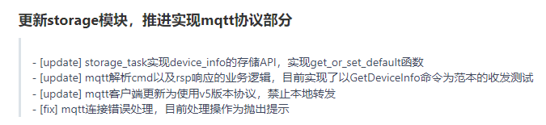
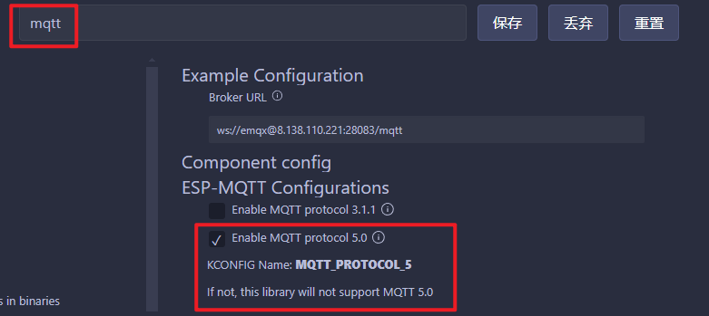
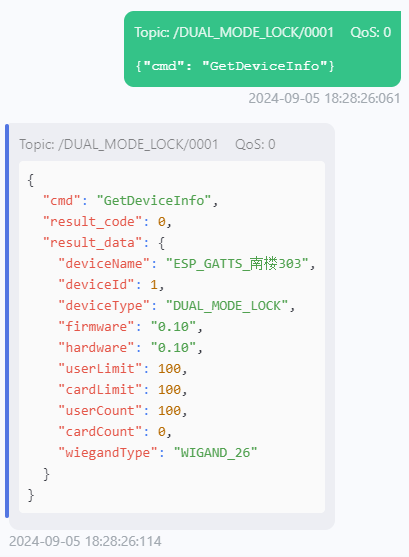

# 240905-更新 Storage 以及 MQTT 模块部分，逐步实现私有 json 协议

## 1 提交

>本次提交： https://gitee.com/chenym_simpler/git_lock_electromagnet/commit/5bda321cc7d5459e0bb0fdf33590a92ee622d0a9



## 2 Storage 部分

对于需要掉电保存的数据来讲一般可以分作字符串以及数据类，例如：

```c
typedef struct
{
    char name[32];
    uint16_t id;
    char type[32];
    char firmware_version[8];
    char hardware_version[8];
    uint16_t max_user_count;
    uint16_t max_card_count;
    uint16_t user_count;
    uint16_t card_count;
    char wiegand_type[16];
} device_info_t;
```

该结构体中 `name` 即属于字符串、`id` 等就属于数字类型

若按照原本 nvs 的操作，存储单单一个变量的操作i就会过于冗长：

```c
/* 获取device_info */
err = nvs_get_blob(nvs_handle, NVS_KEY_NAME_DEVICE_NAME, device_info.device_name, 25);
if (err != ESP_OK)
{
	ESP_LOGE(TAG, "Failed to get device name, config default value");

	strcpy(device_info.name, DEVICE_DEFAULT_NAME);

	/* 缺省值配置 */
	err = nvs_set_blob(nvs_handle, NVS_KEY_NAME_DEVICE_NAME, device_info.device_name, 25);

	return 4; // 随手写的返回码，不用在意
}
```

因此考虑封装一个函数用于简化初始化变量的读取操作：

```c
esp_err_t nvs_get_or_set_default(nvs_handle_t nvs_handle, const char *key, void *value, size_t length, const void *default_value)
```

该函数接收需要操作的 nvs 句柄、nvs 键名、读出变量指针、读出长度、默认变量指针

>之所以这里都使用变量指针的方式是由于每个需要存储的数据都是不定长的，并且在编译后没有分配静态内存

该函数实现：

```c
if (value == NULL || default_value == NULL)
{
	ESP_LOGE(TAG, "Value or default value is NULL");
	return ESP_ERR_INVALID_ARG;
}

esp_err_t err = nvs_get_blob(nvs_handle, key, value, &length);
if (err != ESP_OK)
{
	ESP_LOGE(TAG, "Failed to get %s, config default value", key);

	memcpy(value, default_value, length);

	/* 缺省值配置 */
	err = nvs_set_blob(nvs_handle, key, value, length);
	if (err != ESP_OK)
	{
		ESP_LOGE(TAG, "Failed to set default value for %s, err: %x", key, err);
		return err;
	}
}

// 检查 value 是否为字符串并以空字符结尾
if (((char *)value)[length - 1] != '\0')
{
	ESP_LOGW(TAG, "Value for %s is not a null-terminated string", key);
	return ESP_ERR_INVALID_ARG;
}

ESP_LOGI(TAG, "[CONFIG] %s: %s", key, (char *)value);
return ESP_OK;
```

主要是在默认值的定义上面稍微绕了一下弯子，由于所有默认值都是使用 `#define` 来定义的，因此在传入的时候需要变量指针不太方便

这里又使用了一下 c99 的特性复合字面量，笔记见这个[链接]()，也使用了一下 c11 引入的泛型选择器 `_Generic()` ，笔记见这个[链接]()

```c
#define PTR_TO_CONST(x) _Generic((x),    \
	int: (const void *)&(const int){x},  \
	const char *: (const void *)(x),     \
	char *: (const void *)(x))           \
```

通过以上操作便把初始化函数重构为以下样式：

```c
STG_err_t storage_read_init_value(void)
{
    nvs_handle_t nvs_handle;

    /* 打开nvs */
    esp_err_t err = nvs_open(STORAGE_ENTRANCE, NVS_READWRITE, &nvs_handle);
    if (err != ESP_OK)
    {
        ESP_LOGE(TAG, "Failed to open nvs");
        return STG_ERR;
    }
...
    err = nvs_get_or_set_default(
        nvs_handle,
        NVS_KEY_NAME_DEVICE_FIRMWARE_VERSION,
        device_info.firmware_version,
        sizeof(device_info.firmware_version),
        PTR_TO_CONST(DEVICE_DEFAULT_FIRMWARE_VERSION));

    err = nvs_get_or_set_default(
        nvs_handle,
        NVS_KEY_NAME_DEVICE_HARDWARE_VERSION,
        device_info.hardware_version,
        sizeof(device_info.hardware_version),
        PTR_TO_CONST(DEVICE_DEFAULT_HARDWARE_VERSION));
...
    /* ------------------------------ 获取初始化信息结束 ----------------------------- */

    nvs_close(nvs_handle);

    return STG_OK;
}
```

## 3 MQTT 部分

IDF 的文档对于 MQTT5 的部分还没有完善的很详细，反正今天找到的官方文档上面只丢了一个一年前的例程：

> [官方 MQTT5 例程](https://github.com/espressif/esp-idf/tree/66733762/examples/protocols/mqtt5)

简要记录一下踩的🕳：

首先 IDF 上面如果要使用 MQTT5 的话不光 menuconfig 里面要勾上 Enable：



而且在初始化 mqtt_client 句柄的时候也要指定：

```c
const esp_mqtt_client_config_t mqtt_cfg = {
	.broker.address.uri = CONFIG_BROKER_URI,
	.session.protocol_ver = MQTT_PROTOCOL_V_5, // <HERE>
};

client = esp_mqtt_client_init(&mqtt_cfg);
```

主要是希望使用一下 MQTT5 的 No local 功能，因为不想改协议内容（）

```c
static esp_mqtt5_subscribe_property_config_t subscribe_property_nolocal = {
    .subscribe_id = 25555,
    .no_local_flag = true,
    .retain_as_published_flag = false,
    .retain_handle = 0,
};
```

```c
static esp_mqtt5_user_property_item_t user_property_arr[] = {{"board", "esp32"}, {"u", "user"}, {"p", "password"}};
```

```c
esp_mqtt5_client_set_user_property(&subscribe_property_nolocal.user_property, user_property_arr, USE_PROPERTY_ARR_SIZE); // 设置用户属性
esp_mqtt5_client_set_subscribe_property(client, &subscribe_property_nolocal);                                            // 设置订阅属性
msg_id = esp_mqtt_client_subscribe(client, device_mqtt_topic, 0);
esp_mqtt5_client_delete_user_property(subscribe_property_nolocal.user_property); // 删除用户属性
subscribe_property_nolocal.user_property = NULL;
ESP_LOGI(TAG, "sent subscribe successful, msg_id=%d", msg_id);
```

以上都是暂时模仿官方例程里面的写法进行配置

配置结果：



>数据都是测试数据

