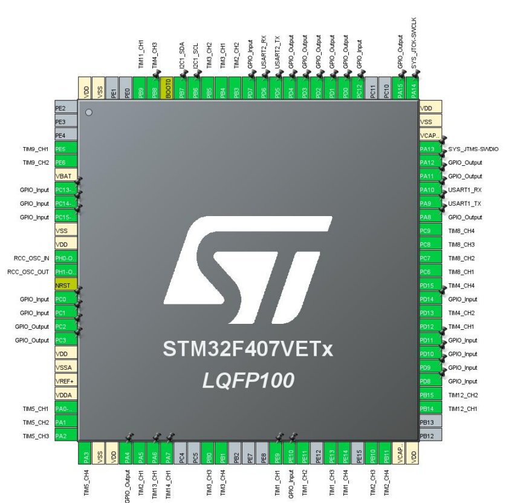
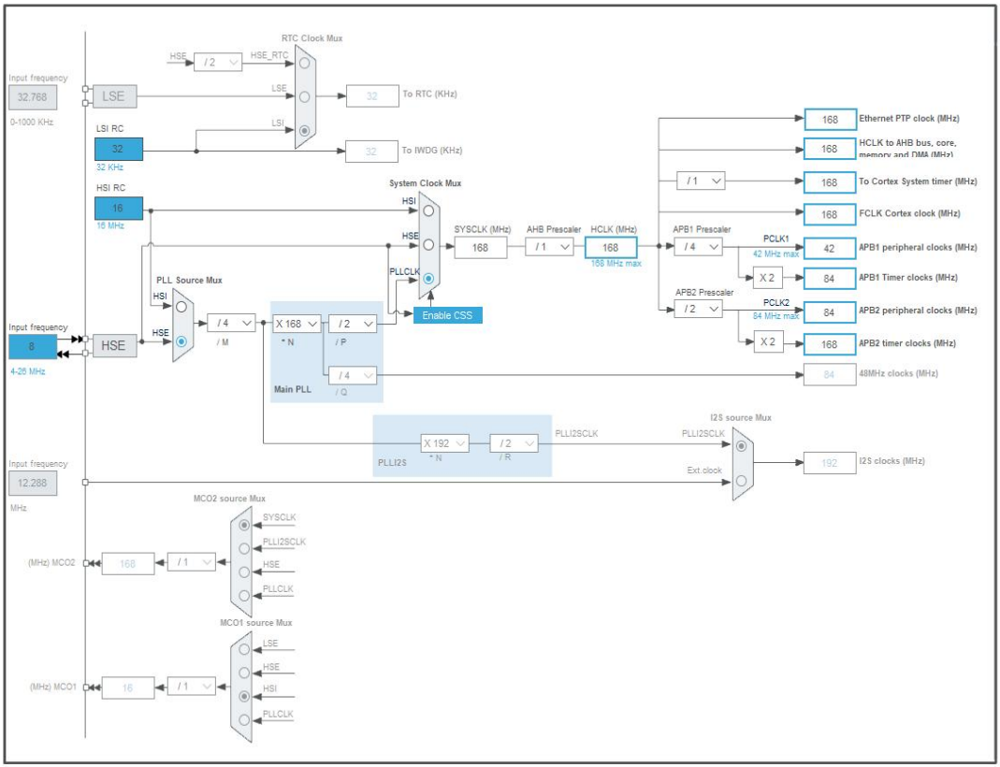

# 240814-CubeMX+FreeRTOS开发笔记

# 硬件参考

## 1 引脚参考

使用 cubemx 配置引脚，外设使用情况如上

## 2 时钟树参考

- APB1 总线速度：`42MHz`
- APB1 定时器时钟：`84MHz`
- APB2 总线速度：`84MHz`
- APB2 定时器时钟：`168MHz`

APB1 总线速度必须小于 `42MHz`；APB2 总线速度必须小于 `84MHz`

## 3 定时器

由于光源驱动需要，本次硬件设计需要非常多的 pwm 输出通道，故在此对于 F407VET6 的定时器资源做简要笔记

定时器外设部分一般适用于整个 F4 系列

STM32F405xx/07xx 和 STM32F415xx/17xx 的定时器时钟频率由硬件自动设置。分为两种情况：

1. 如果 APB 预分频器为 1，定时器时钟频率等于 APB 域的频率。 
2. 否则，等于 APB 域的频率的两倍 (×2)。

TIM1、8、9、10、11 属于 APB2 总线，最高可达 **168MHz**

TIM2、3、4、5、12、13、14 属于 APB1 总线，最高可达 **84MHz**

